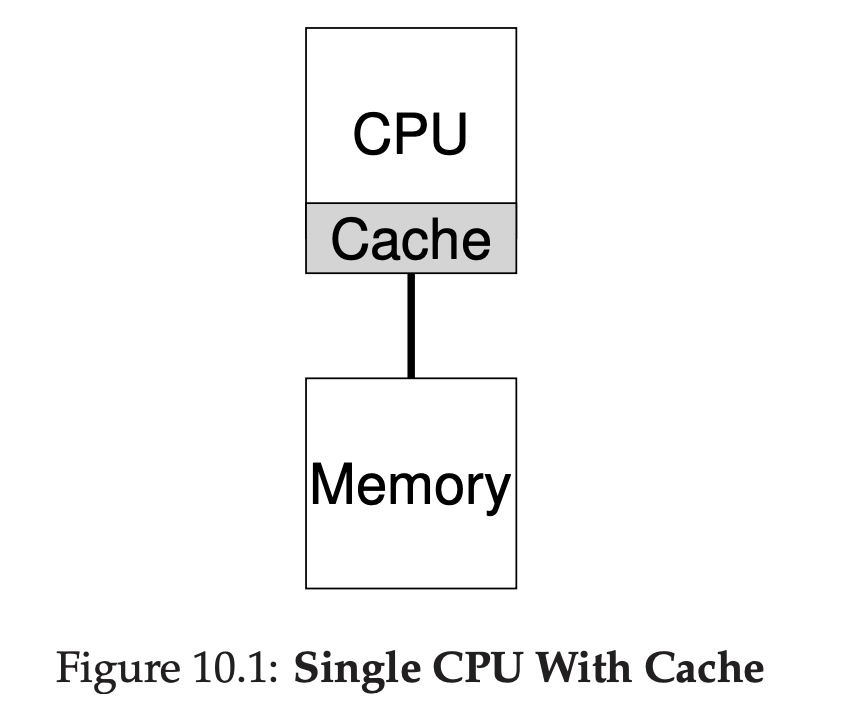
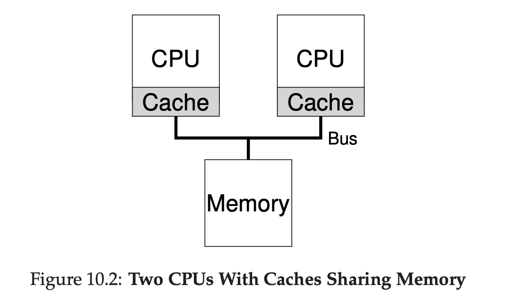

# Multiprocessor Scheduling (Advanced)

## Background: Multiprocessor Architecture

We need to understand between single CPU vs multiprocessor

In single CPU, there are a hardware cache to help processor run program faster.

Cache are small fast memory that hold copies of popular data.

Main memory holds all data, but slower than cache.

For example, assuming a computer have memory and 64kb cache.

The first time program loaded, the data resides in memory, that means it will take longer to fetch, after it goes to CPU, it will be putted in cache.

When the same data used again, it will fetch from cache, making it faster to fetch.

There are 2 kind of cache locality, temporal locality and spatial locality.

Temporal locality means, if the data recently got accessed, it might be accessed again in the future.

Spatial locality means, if the data accessed on location X, it might also access near X.

The question is, what happens when we have multiple processor?

Example:

Program running at CPU 1 read data value D at address A. Because the data not in cache, it will directly fetch from memory.

The CPU 1 also update the value becomes D'. But because writing to the memory is slower, CPU usually write on the cache only and will do it later on memory.

Then, context switch happens, CPU 2 read address A. There's no data on cache, that means it will read from memory.

But the address A not yet got updated from CPU 1, that means CPU 2 will get value D.

This problem is called problem of cache coherence.

One way to do it by doing old technique called `Bus Snooping`, basically each cache will pay attention to memory update via bus.

When update is coming, that cache will be invalidated / update to new value.

## Don’t Forget Synchronization

When accessing shared data items across CPU, mutex should be used to guarantee correctness.

## One Final Issue: Cache Affinity

Tldr, process will be faster if it's pinned by specific CPU. Because that CPU already cache the data.

## Single-Queue Scheduling

We can use the previous single queue for doing multiprocessor scheduling, it's called SQMS (Single Queue Multiprocessor Scheduling)

However, SQMS has some weakness, one of them is lack of scallability.

We need some kind of locking to make this scheduler working correctly, and locks actually reducing performance.

Second problem is cache afinity, because CPU doesn't track which process went to which CPU.

To handle this problem, most SQMS scheduler include some kind of affinity mechanism to make it more likely take the recent process to their CPU.

## Linux Multiprocessor Schedulers

In linux community, 3 different solution rose, O(1) scheduler, Completely Fair Scheduler (CFS), and BF scheduler (BFS).

Both O(1) and CFS using multiple queues, and BFS using single queue.

O(1) using priority based scheduler.

CFS is kinda like stride scheduling