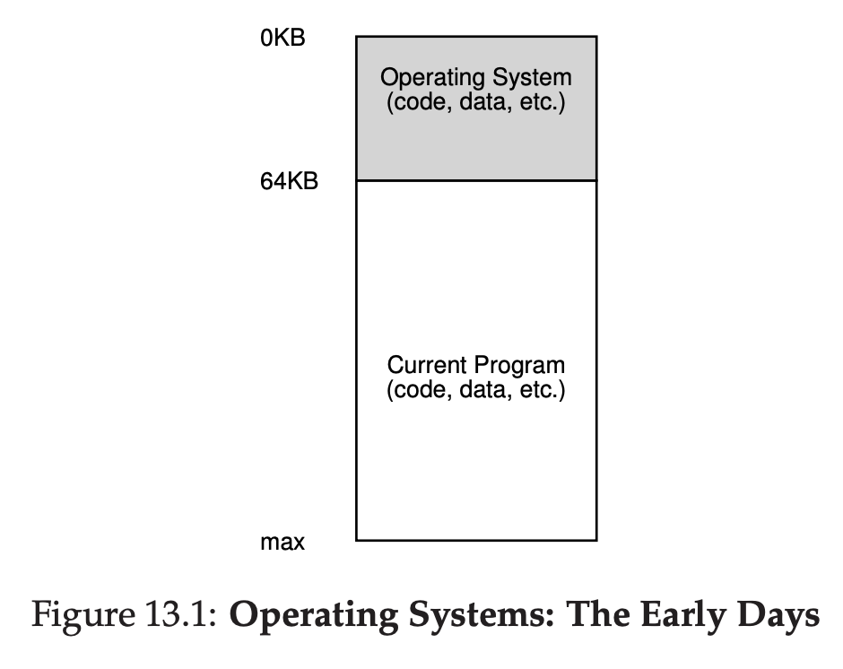
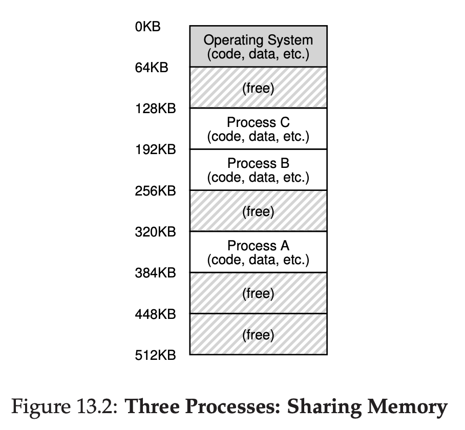
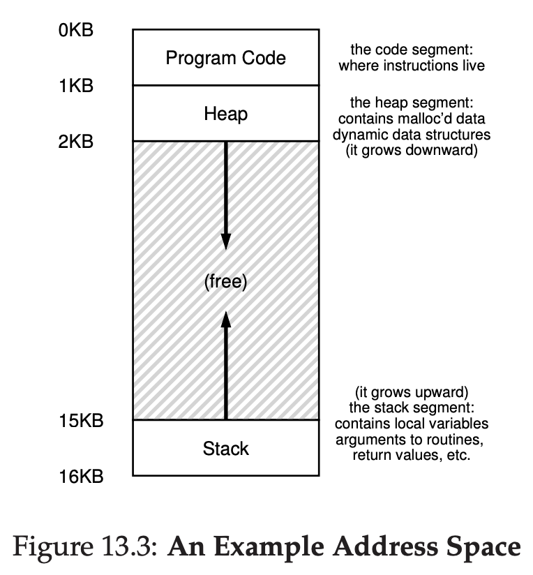

# The Abstraction: Address Spaces

## Early Systems

OS was a set of routine / library that sat in the memory. The position starting at physical address 0, and there would be a running program that current sat in the memory also. It placed after the end of OS memory.

## Multiprogramming and Time Sharing

Time skips, because machine was so expensive, people try to implement multiprogramming. Which is multiple process are running at a given time, OS will try to switch between them, for example which one doing I/O, which one running on CPU.

Time skip again, era time sharing comes. One way to do it is put the process in memory, gaining access for whole memory, run it, stop it, save the state to physical memory, and move to another process. This approach is actually really slow, while saving and restoring register-level state is relatively fast. 

We rather just leave the process in the memory while we switch between them.

It raises a new problem, which is security, we don't want process A can read / write anything on process B.

## The Address Space

To prevent process A can read other process memory, we need OS to create an abstraction on physical memory. We call this abstraction **Address Space**, and the running program can only see it's own address space.

Address space contains all memory state of the program, for example is Code of the program (The instruction of the process).

When program is running, program uses **stack** to:

- Keep track where's the current function call chain at
- Storing the local variable
- Storing the parameter that are passed to function
- Return value of a function

Program also use **heap** to:

- Store dynamically allocated variable that are called via malloc() or new

There's also statically-initialized variables. But let's skip for now.

So in process Address Space, there's

- Code
- Stack
- Heap

As you can see on image, because code doesn't change, code is placed at address 0, heap and stack are memory address that can grow, because of that, both are placed in the opposite side.

Address 0 is just an abstraction for a process, OS already gave an illusion to a process that the starting address starts from 0. It is called virtualizing memory.

## Goals

This is why OS virtualize memory

### Transparency

OS virtualize memory so it will give an illusion to process, process shouldn't be aware that the memory they're using is actually shared by other process

### Efficiency

OS virtualizing memory so it can achieve an efficiency as high as possible.

### Protection

By isolating the process to each own Address Space, process can't read / update other process's memory.

## Summary

In order to do fast timesharing, OS shares the memory to multiple process.

It raises another problem, which is process A can read process B memory.

To prevent that to happen, OS create something called address space, it basically isolating the memory to it's own process, so the process can only read it's own memory.