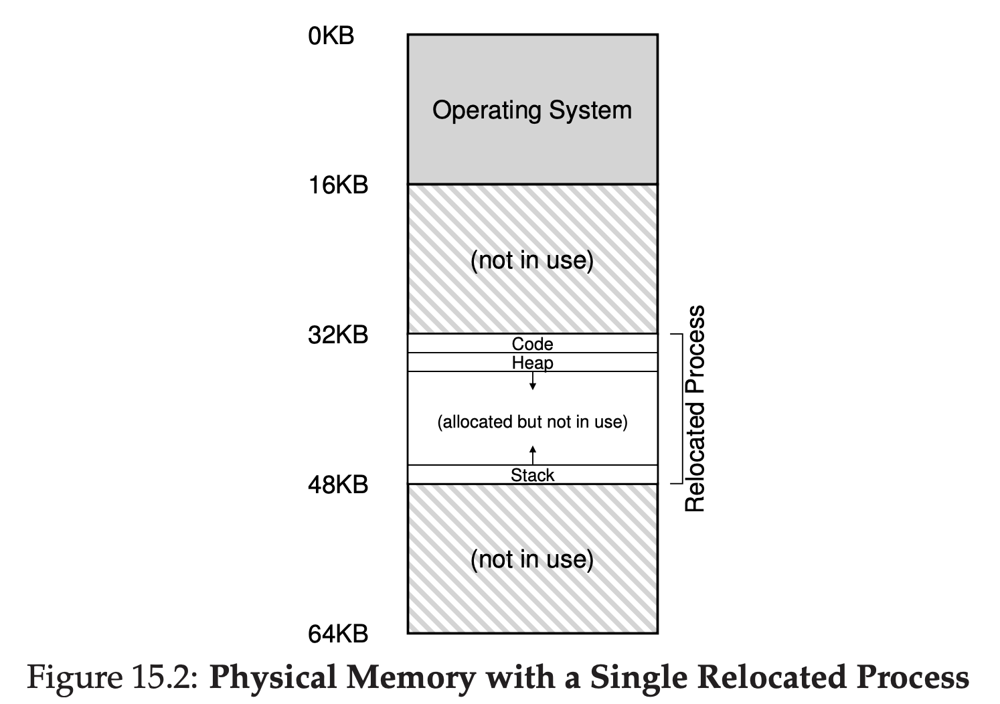
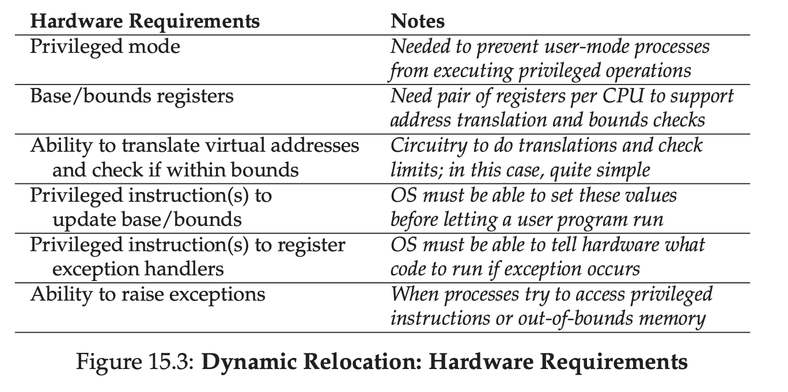

# Mechanism: Address Translation

## Limited Direct Execution (LDE)

LDE makes the the program runs directly on the hardware.

But at some point (system call / interrupt happened). OS will get involved and doing something.

That means, with a little hardware support, OS will try their best to make sure the virtualization runs efficient as possible.

However, OS doing interupt at some critical point, that means OS also doing **control**.

Efficiency & Control are two of main goals in modern Operating System.

### Efficiency

Efficiency means we'll try to maximize the hardware support for the process. Because running process on top of process directly is faster.

### Control

Control means we'll try to make sure the process can only touch it's property, other process's memory for example, they can't read / update it.

### Flexibility

We also try to give some flexibility to our system, we will give some kind of VM system, that make the process to use their address space whatever they want.

## Hardware Based Address Translation

We also will use a technique named Hardware-Based Address Translation / Address Translation, what it does is.

Hardware will transform each memory access, ex:
- Instruction fetch
- Load
- Store

Change it from virtual address into physical address.

That means, every memory access that got executed by a process, hardware will translate that to a real physical address.

## Assumption

- User address space must be placed contiguously in physical memory.
- Size of address space is not too big
- Each address space is on same size

## An example

```
void func() {
int x;
x = x + 3; // this is the line of code we are interested in
```

The compiler will turn this code into this assembly code.
```
128: movl 0x0(%ebx), %eax ;load 0+ebx into eax
132: addl $0x03, %eax ;add 3 to eax register
135: movl %eax, 0x0(%ebx) ;store eax back to mem
```


What it does is basically like this:
- Fetch instruction at address 128
- Execute this instruction (load from address 15 KB)
- Fetch instruction at address 132
- Execute this instruction (no memory reference)
- Fetch the instruction at address 135
- Execute this instruction (store to address 15 KB)

From program perspective, it's address space start at address 0, and grows to maximum 16KB.

This is actually an illusion from virtualization of memory from OS.



## Dynamic (Hardware-based) Relocation

In 1950s, there's a concept called **base and bounds** or **dynamic relocation**. 

In this concept, we need two register.

- Base register
- Bound register

This registers will help us to place the address space anywhere we'd like in physical memory.

Each program is written and compiled will think they will have own address space starting from 0.

However, OS decides where physical memory will start and will put the base start on base register.

```
physical address = virtual address + base
```

This is called **address translation**. Which is hardware takes the virtual address and convert it into real physical address.

The bound is to check is the virtual address is the legal address. For example the address is more than it should be / less than it should be. It will be counted as illegal and raises an exception.

## Hardware Support: A Summary

To make all of these happen, we need some things:

- Kernel Mode & User Mode
- A processor status word (To know which mode we're currently at)
- 2 registers, for base & bound register (This is part of **Memory Management Unit** of CPU)
- Hardware should provide a special instruction to modify base & bound value. This is a privileged instruction, so only in **kernel mode**.
- CPU should be able to raise an exception if program tries to access memory illegally, ex: Out of bound, changing the base & bound value.



## Operating System Issues

### OS need to take action when process is created

Assuming each address space for process is:
- Smaller than the size of physical memory
- Same size

This will be easy for OS.

OS will just look at physical memory as an array of slots, check which one is free.

When new process is created, OS will search on data structure (free list) to find a place where it can put the process to and mark it's being used.

### OS must do some work when a process is terminated

When process is terminated (exit gracefully, terminated, crashed), OS need to reclaim the memory address that has been used and update the free list data structure

### OS must also perform a few additional steps when a context switch occurs

There's only 1 base & bound register in each CPU, so OS need to update that value between process changes.

### OS must provide exception handlers

If process tries to access memory illegally, OS must be prepared to take action.

## Summary

OS has 2 goals, to be Efficient as possible and still keep control.

To achieve this goals, OS virtualize the memory so it will give an illusion to process.

Process will think the memory start from address 0. But, what actually happening is Process use virtual address to access the memory.

Virtual memory will be translated into Physical address by doing Address Translation, this actually done by the hardware.

To be able to do this, we need 2 register

- Base register
- Bound Register

If process tries to access memory illegally, OS is ready to raise an exception, this will make the process terminated.