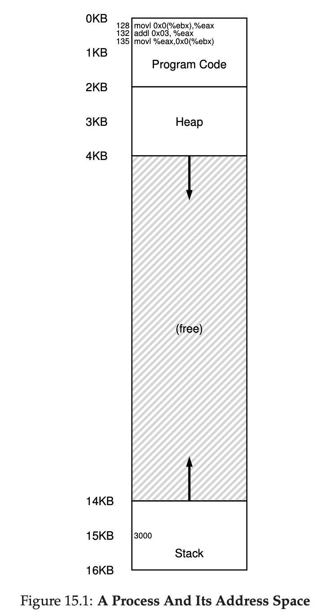
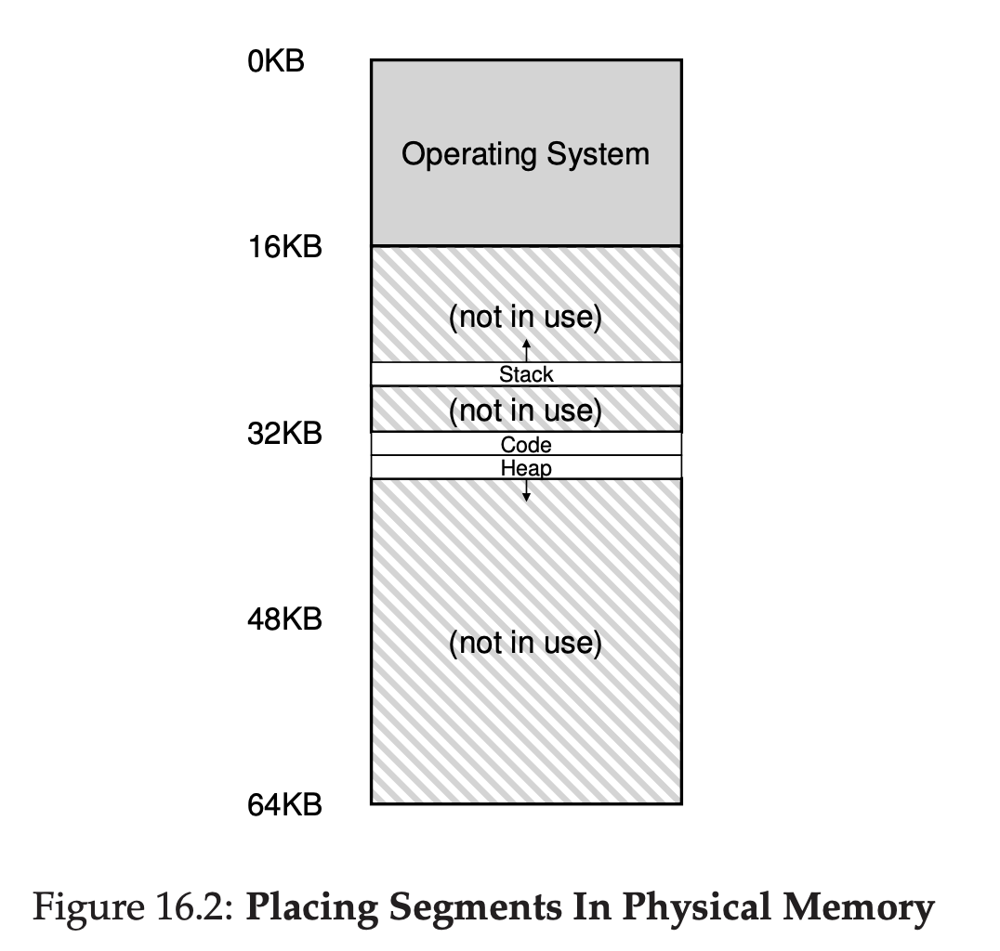
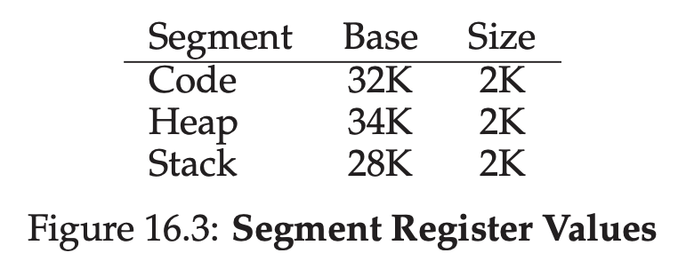
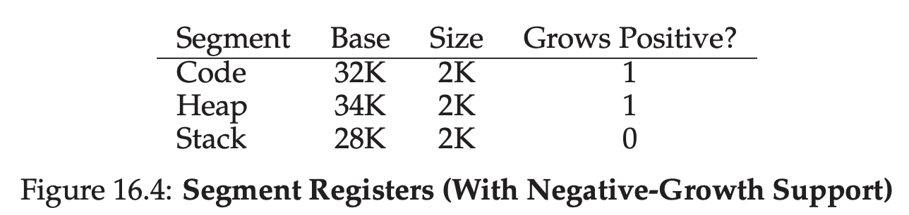
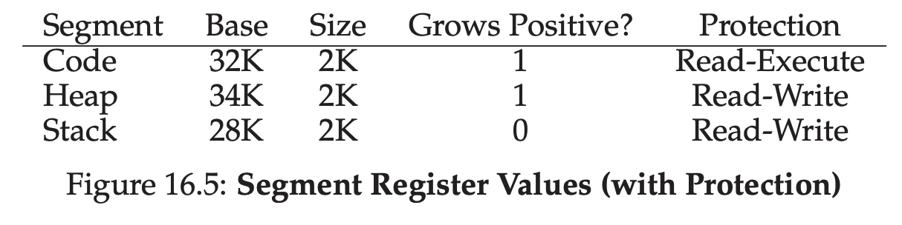
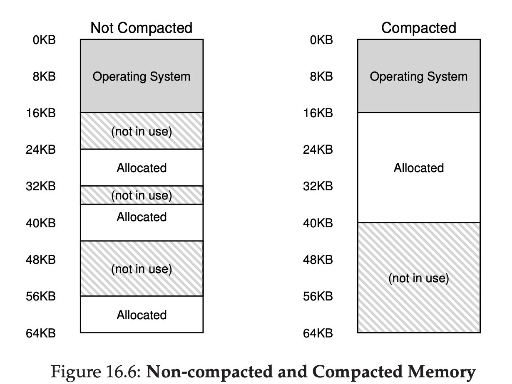

# Segmentation

For base & bound approach, you can see in the middle between Heap and Stack, there's a free space. We consider this as wasteful.

## Segmentation: Generalized Base/Bounds

There's an idea called **Segmentation**

The idea is simple, instead of having one base and bound in our MMU. How about we have base and bound per logical **segment** of address space?

A **segment** is a contiguous portion of address space of a particular length. And in our address space, we actually have 3 different segment.

- Code
- Stack
- Heap

That means, with segment, we can just put those 3 in three different place non contiguously.

## What About The Stack?

Stack is actually grow backward, how does the translation making sure it's working fine?

We can put boolean value to let the hardware know which segment grow backwards.

## Support for Sharing

To improve efficiency, especially saving memory, sometimes it's useful to share certain memory segment. 

### Code Sharing

To support sharing, we need extra support from hardware, we add 1 more value to register called protection bits.

By setting code segment to read-only, same code can be shared across multiple process without harming isolation.

## OS Support

We now have a basic idea how segmentation works.

Pieces of address space are relocated into physical memory.

Making the space is not wasteful like before.

However, segmentation now raises new issues:

### What should OS do when Context Switch?

Each process has it's own virtual address space, OS must make sure to setup the registers correctly before letting the process run again.

### OS Managing free space in physical memory

When new address space is created, OS need to find free space in physical memory for it's segment.

Previously we assumed all address space is the same size. Now we have number of segments per process, that means each segments has different size.

Problem raises when the physical memory has a lot of small hole of free space. Making the OS hard to allocate new segments. This is called **external fragmentation**.

One solution for this is to **compact** the physical memory by rearanging the existing segments.

For example, OS can stop the running program, copy the data into one contiguous region of memory, change their segment register values to new one, and rerun it again.

However, doing compaction is expensive. Copying the segment is memory intensive and doing it is heavy CPU related.

A simpler approach is to do free list management algorithm.

There's a lot of flavour for this, for example **best fit algorithm**, **worst fit**, **first fit**, and more complex is **buddy algorithm**.

But what we know is, no matter how smart the algorithm, we can't avoid external fragmentation, we can just minimize it.

## Summary

Segmentation is a technique to split the Address space into multiple Segment. 

We do this to prevent the memory go waste because a lot of memory not being used.

The problem with segmentation is External Fragmentation, basically it happened when Physical memory have a lot of small hole that makes OS can't allocate new segment.

One of way to solve this to do Compacting, basically OS will try to tidy up the memory and compact it, but the problem with Compacting is, it's memory + CPU heavy.

One of way to minimize this is to do free list management algorithm like **best fit**, **worst fit**, etc. But this can't 100% solve the issue, this can just minimize the issue of external fragmentation.