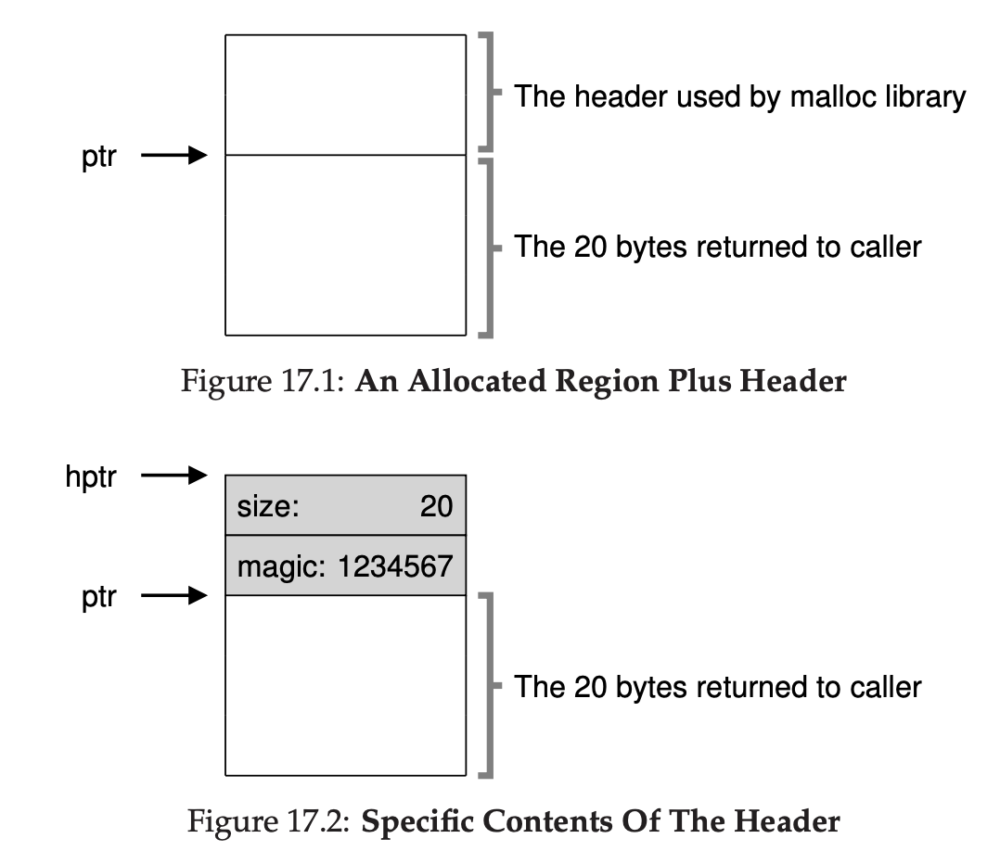
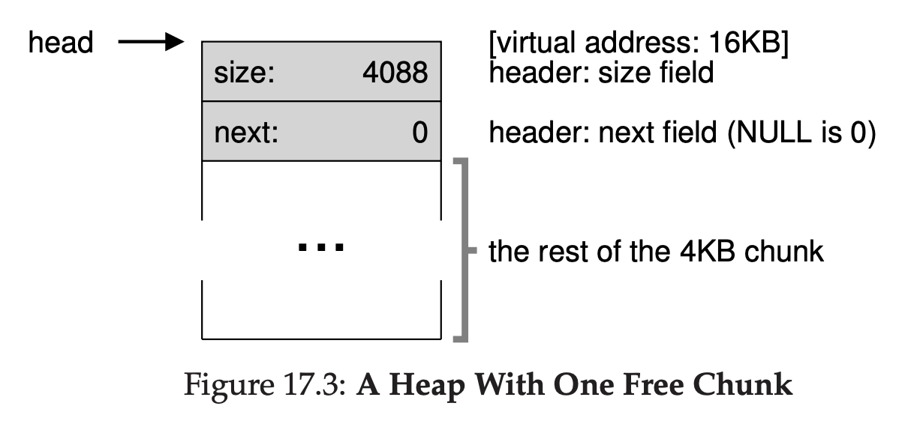
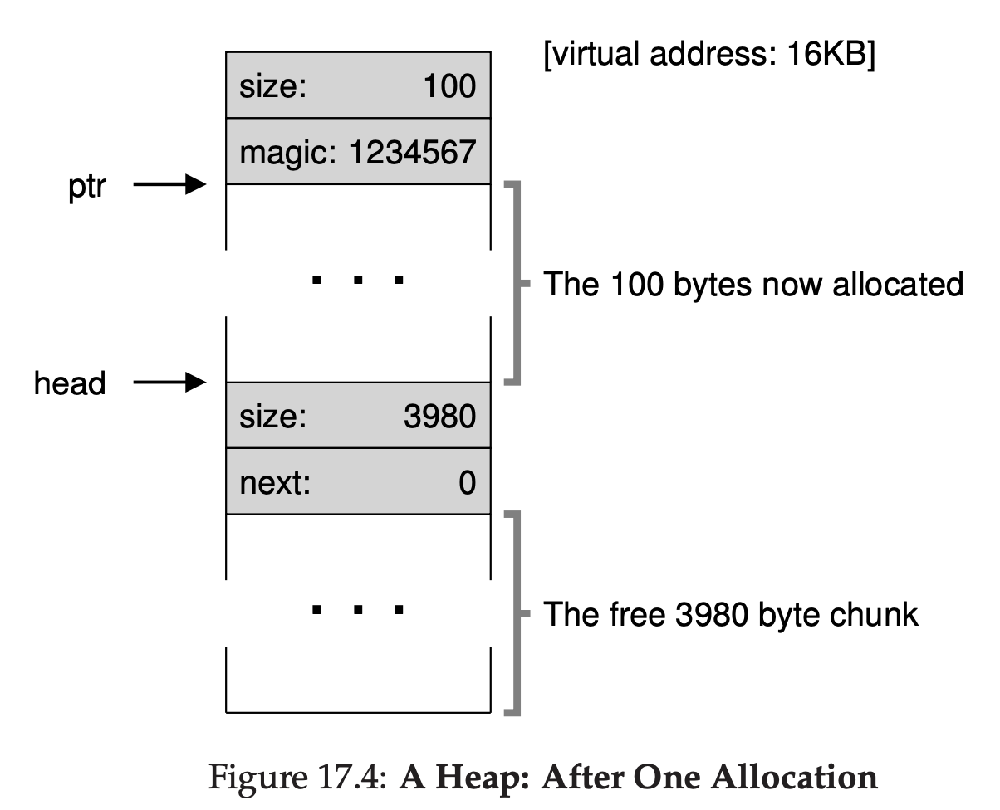
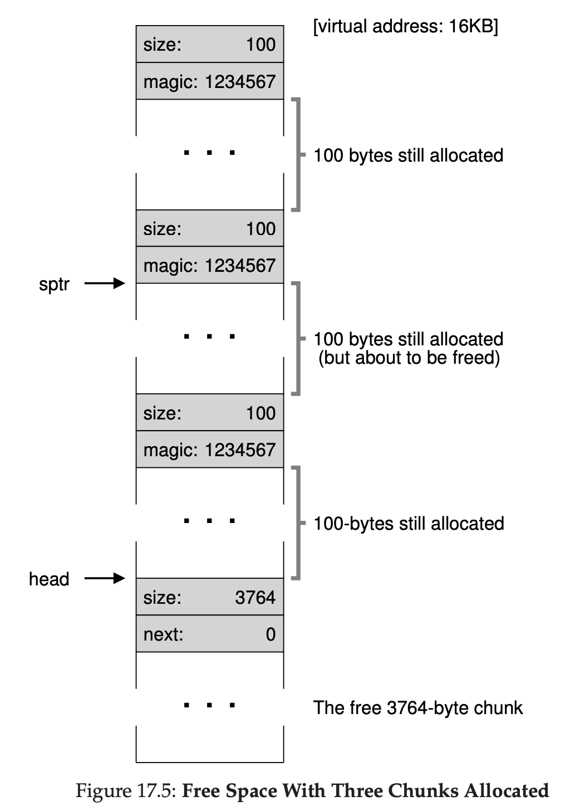
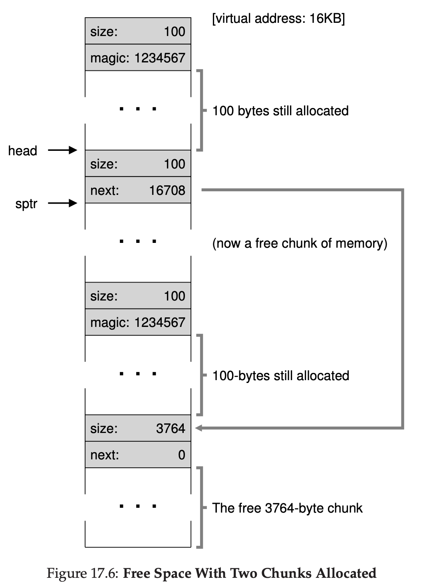
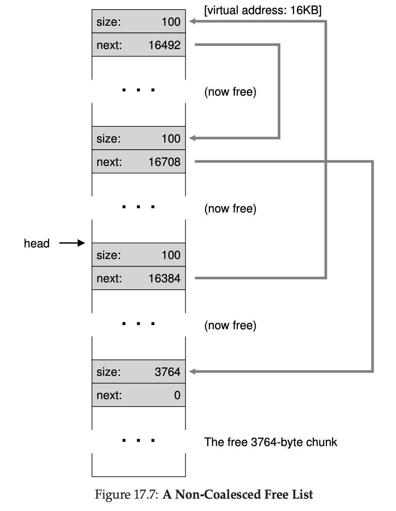
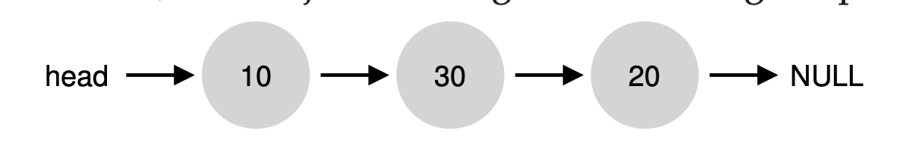
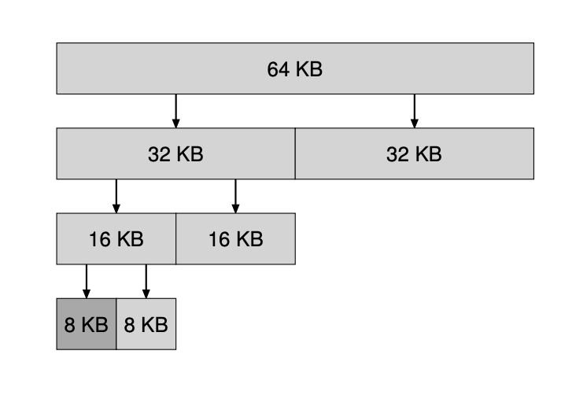

# Free-Space Management


Let's try to remember what is external fragmentation is.

We have memory with size 30KB. Then in the middle, we use that memory, we use it from 10KB to 20KB. Taking 10KB of size.

Now we have 20KB of free space, but because we use the middle of free space. The free space is 2 10KB. We can't put a program that has >10KB of memory space needed.

## Assumptions

We assume in this OS
- OS allow us to do malloc & free
- When calling free, OS know how many size of memory will be deleted
- Once memory is handed to client, it cannot be relocated to another location in memory. That means, no compaction can happen.
- Allocator manages contiguous region

The space of this data will be stored in heap. And all of those pointer will be stored on generic data structure called **free list**.

When we're concerning about internal fragmentation, we also need to be aware about **Internal fragmentation**.

**Internal fragmentation** happens when allocator of memory is giving a chunk of memory larger than we requested. Any unused / unasked memory we consider this as internal fragmentation.

## Low Level Mechanism

### Splitting and Coalescing

Free list contains set of elements that describe the free space of heaps

Assuming the heap like this


The free list will have 2 elements will look like this:


If the request is larger than 10 bytes, it will fail.

If the request is smaller than 10 bytes, for example just 1 byte, the allocator will do splitting.

Allocator will find free chunk of memory that can satisfy that, and split it into two.

First chunk will go to caller, second chunk will remain in the list.

Assuming allocator choose the second node, the free list will look like this


List basically stay intact, only changes the free region now start from address 21.

Now, let's assume the heap look like this again


Assuming the middle used memory got freed.

That means all of the memory is free.


But the free heap is divided into 3 chunk,what allocator do is to do **coalesce** the memory. It basically check when memory is freed, if the freed memory is sits next to one or two free memory, it will merge those into 1 node of free memory.

## Tracking The Size Of Allocated Regions

When we're doing free(ptr), how does the OS know how much memory should be freed?

It's because when we do malloc(size), there's actually a header to tell how much size it took for that pointer.



It may also contains additional pointers to speed up deallocation, a magic number for integrity checking, and other information, but for simplicity, let's just have size and magic number

```
typedef struct __header_t {
    int size;
    int magic;
} header_t;
```

Then, when user do free(ptr), the library can just do something like this

```
void free(void *ptr) {
    header_t *hptr = (void *)ptr - sizeof(header_t);
    ...
```

After getting the pointer of header, it will do integrity checking like this
```
assert(hptr->magic == 1234567)
```

And calculate the total size used by doing simple math, size header + size data

## Embedding A Free List

Free list will be inside the free space itself.

Assuming we have 4096 chunk of memory to manage (heap is 4KB).

We need to initialize this list, initially the list will only have 1 entry, and the size of the list will be 4096 - header.

```
typedef struct __node_t {
    int size;
    struct __node_t *next;
} node_t;
```

The code that initialized heap will be something like this, disclaimer, this is not only way to initialize heap.
```
// mmap() returns a pointer to a chunk of free space
node_t *head = mmap(NULL, 4096, PROT_READ|PROT_WRITE, MAP_ANON|MAP_PRIVATE, -1, 0);
head->size = 4096 - sizeof(node_t);
head->next = NULL;
```

Now, the free list will look like this



Imagine there's a request of allocation of 100 bytes. Library will find a chunk that having >= 100 bytes. Because there's only 1 free chunk (4088), that chunk will be chosen.

That chunk will be split into 2, one chunk that is for 100 bytes allocation (and the header) and the remaining free chunk, assuming the size of header is 8 bytes.



Now let's look at the heap when we have 3 allocated region, each of 100 bytes.



The free list remain the same, it's just 1 node after doing 3 allocation, but what happen if we doing free()?

Let's assume we did free the middle of the allocated memory. The library now add those size + header size into free list.



Because the free memory is fragmented, now the free list has 2 nodes now.



Assuming we free the last two allocated memory, now we have 4 node in free list. But because now the free memory is neighboring, we can coalesce it. Making the free memory back to 1 node again.

## Growing The Heap

What if the heap runs out the space? Simple approach is just to fail, that means it's returning NULL pointer.

Most traditional allocator start with small heap and request more if needed. That means they will do system call such as `sbrk` to grow the heap, and allocate a new chunk there.

That means, OS will find free physical pages, maps them into the address space of the requesting process, then return the value of the end of new heap.

## Basic Strategies

### Best fit

It's simple, iterate the free list, find >= requested. Return the smallest in that candidates. It's called best fit chunk.

The intuition is simple, by giving them the smallest size, the memory will not go waste. But checking free list one by one maybe a little bit slow.

### Worst fit

Opposite of best fit, find the largest chunk, return the requested amount, keep the remaining chunk on free list.

Same like best fit, the checking free list can a little bit slow.

And also it give excess fragmentation.

### First fit

Find the first chunk that is >= requested size.

It's faster than the previous strat, but sometimes pollutes the beginning free list with small object.

One approach is to use address based ordering, by keeping the list ordered by the address of free space, coalecing becomes more easier.

### Next fit

Almost like first fit, but the next chunk. The idea is to spread the search not too focused on the first chunk.

## Examples



Assuming free list is 10-30-20

Best fit will take 20. That means the free list will become 10-30-5

If worst fit used, it will take the largest one, which is 30, so the final free list will become

10-15-20

First fit will have same result like worst fit, but it will be faster because it will not traverse all of it.

## Other Approaches

### Segregated List

If we know the application usually request a specific number of memory. We can create a dedicated free list for those request. That means, we will never afraid of fragmentation since we already allocate a special list for that request.

This also giving a new idea called **slab allocator**, when the kernels boot up, it allocates the number of object caches for kernel object that usually got requested frequently, ex: (locks, file system inodes, etc). When given cache are running low of free space, it will request some slabs of memory from more general memory allocator.

### Buddy Allocation



Assuming the memory that got requested is 7KB, and the current free memory is 64KB, it will recursively divide it by 2 until it got the smallest of >= requested size, that means it will go to
64 -> 32 -> 16 -> 8

Buddy allocation weakness is, it will prone from Internal Fragmentation.

The good thing about this is, the allocator will check if the "buddy" is free, if it's free, they can be coaleced recursively.

### Other Ideas

One major problem from those approach is lack of scaling. Especially when searching the list can be slow.

Advanced allocator will use more complex data structure to fight this, sacrificiing performance with simplicity, such as using balanced binary trees, splay tree, etc.

A lot of allocator also conccurency supported.

## Summary

Allocating memory can be done using malloc

Deallocating memory can be done using free

Allocator keep track how many size of the memory allocated from the header of the memory.

If allocator give a chunk memory > requested, it's called Internal Fragmentation, we don't want that

If allocator allocates memory and it will make a lot of small chunk that can't be used in the future because it's too small, that's called external fragmentation, we don't want that also.

There's a few way to allocate the free list, such as best fit, worst fit, etc.

There's no best strategy, everything will have drawback.