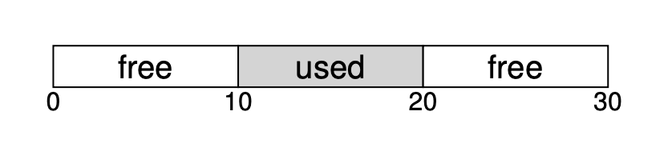
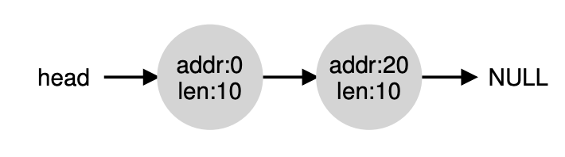
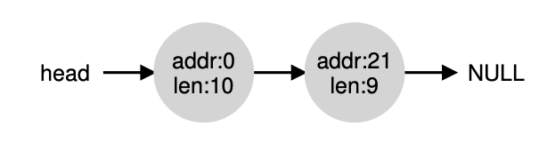
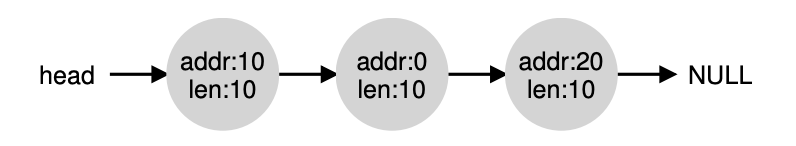

# Free-Space Management

Let's try to remember what is external fragmentation is.

We have memory with size 30KB. Then in the middle, we use that memory, we use it from 10KB to 20KB. Taking 10KB of size.

Now we have 20KB of free space, but because we use the middle of free space. The free space is 2 10KB. We can't put a program that has >10KB of memory space needed.

## Assumptions

We assume in this OS
- OS allow us to do malloc & free
- When calling free, OS know how many size of memory will be deleted
- Once memory is handed to client, it cannot be relocated to another location in memory. That means, no compaction can happen.
- Allocator manages contiguous region

The space of this data will be stored in heap. And all of those pointer will be stored on generic data structure called **free list**.

When we're concerning about internal fragmentation, we also need to be aware about **Internal fragmentation**.

**Internal fragmentation** happens when allocator of memory is giving a chunk of memory larger than we requested. Any unused / unasked memory we consider this as internal fragmentation.

## Low Level Mechanism

### Splitting and Coalescing

Free list contains set of elements that describe the free space of heaps

Assuming the heap like this

The free list will have 2 elements will look like this:

If the request is larger than 10 bytes, it will fail.

If the request is smaller than 10 bytes, for example just 1 byte, the allocator will do splitting.

Allocator will find free chunk of memory that can satisfy that, and split it into two.

First chunk will go to caller, second chunk will remain in the list.

Assuming allocator choose the second node, the free list will look like this

List basically stay intact, only changes the free region now start from address 21.

Now, let's assume the heap look like this again

Assuming the middle used memory got freed.

That means all of the memory is free.

But the free heap is divided into 3 chunk,what allocator do is to do **coalesce** the memory. It basically check when memory is freed, if the freed memory is sits next to one or two free memory, it will merge those into 1 node of free memory.