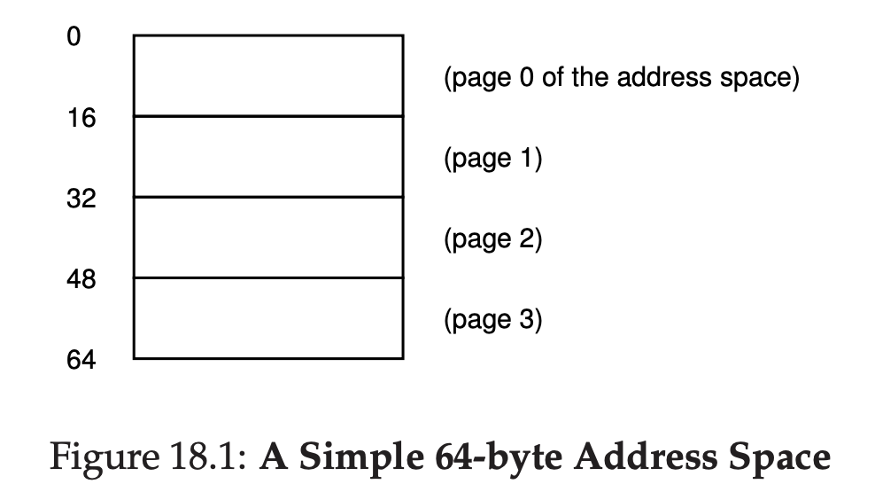
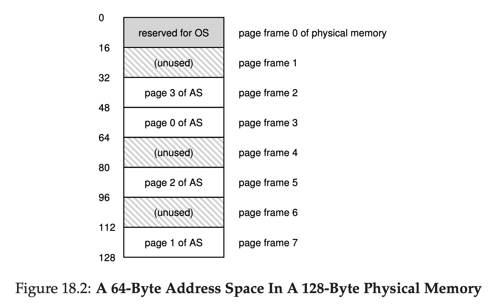
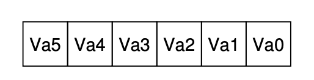
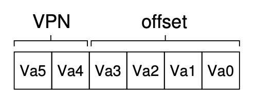
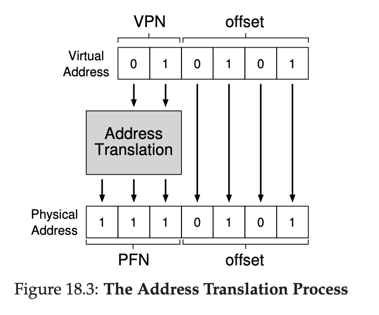
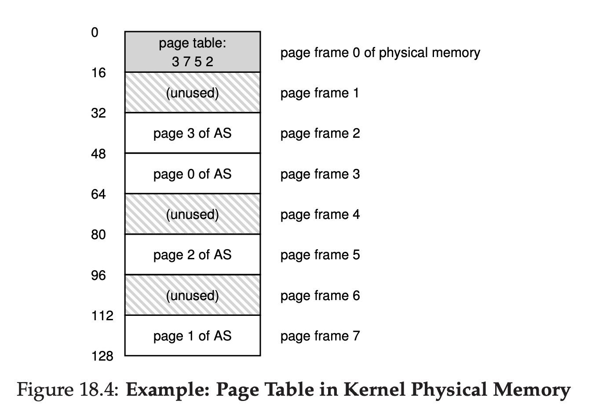
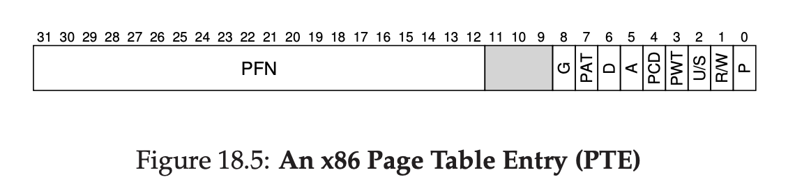
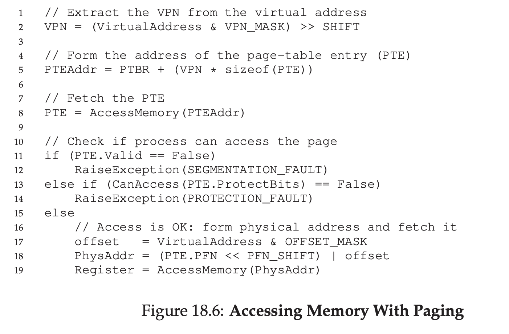
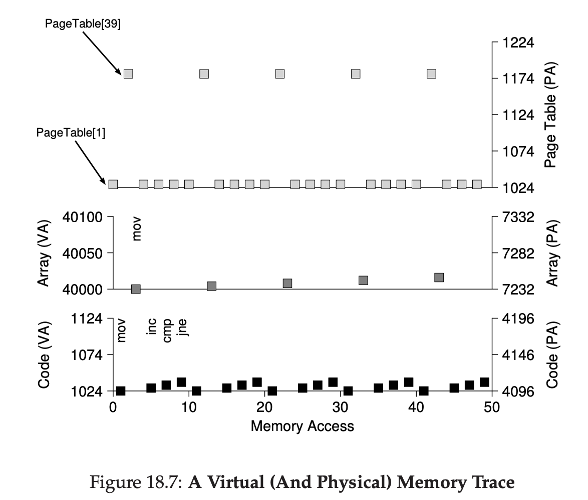

# Paging: Introduction

There's 2 ways to solve space management problems.

First one is to do segmentation, which is already explained in previous chapter. Segmentation is chop the free memory into variable sized.

But segmentation has some problem, one of problem is space can become fragmented. The allocation will be hard in the future overtime.

Second is to do paging, the approach is chop up the free memory into multiple fixed sized memory, instead of splitting address space into some number of variable sized segments (heap, stacks, code). The fixed sized unit is called page.

We view physical memory as an array of fixed sized slot called page frames.

## A Simple Example And Overview

Assuming free address is sized 64KB. And 1 page is equivalent to 16KB.

The memory will look like this





To record where each virtual page of the address space is placed in physical memory, the OS usually keep a per-process data structure known as **page table**.

Page table is to store address translation for each virtual tables of address space.

For example, page table will track something like this:

- Virtual Address 0 -> Page Frame 3
- Virtual Address 1 -> Page Frame 7
- Virtual Address 2 -> Page Frame 5
- Virtual Address 3 -> Page frame 2

Remember, page table is per process data structure (exception to inverted page table, but we'll talk it later).

This is what OS does when process doing memory access:

```
movl <virtual address>, %eax
```

To translate this virtual address, we have to split 2 components, **virtual page number (VPN)** & **offset**.

Because we have 4 pages, and each page has 16KB of size. That means we will need 64KB of data. Because we have 64KB of data, that means we will need log(64) of bits, which is 6 bits.



In this diagram, Va5 is the highest order bit of the virtual address, and Va0 is the lowest order bit.

Because we have 16KB for page size, and we have 4 pages, the representation will look like this.



VPN will take 2 bit, that means max val is 3. Which is can cover all of the pages (0-3).

Offset will take 4 bit, that means max val is 15, Which is can cover all of the page size (0-15).

Assuming process want to access address 21.

```
movl 21, %eax
```

21 to binary is `010101`. We split it `01` and `0101`. That means it will go to page 1 and offset 5.

Now we can search on our page table, where is page 1 and offset 5 in the real physical address.

Based on the previous image, we can see page 1 is actually inside Physical address no 7 (binary 111).

Keep in mind, we only translate page, offset no need to be translated.

That means, virtual address 21 `010101` if got translated, it will becomes `1110101` (117 in decimal).



## Where Are Page Tables Stored?

Page table can become very big.

For example, imagine typical 32-bit address spaces, with 4KB per page. 4KB is 4096, that's 12 bit needed.

That means, 

32 - 12 bit = 20 for VPN
12 bit for Offset.

Assuming we need 4 bytes per page table entry to hold the physical translation plus other useful stuff, we need 4MB per page table. If we have 100 process, that means we need 400MB. That's a lot.

Because page table is so big, we store page table for each process somewhere, let's just assume now, page table is residing somewhere that OS manages.



## What’s Actually In The Page Table?

Page table is just a mapping between virtual address (virtual page number) with physical address (physical frame number).

That means, any data structures can works here, the simplest forms is called **linear page table**, which is just an array.

OS indexes the array by virtual page number (VPN), and look up the page table entry (PTE), at that index in order to find the Physical Frame Number (PFN).

Inside PTE, there's a lot of things stored, such as

- PFN
- Valid Bit
- Protection Bit
- Present Bit
- Dirty Bit
- etc



## Paging: Also Too Slow

With page tables in memory, we already know they may be too big, and they can be also slow too.

Assuming this instruction
```
movl 21, %eax
```

To fetch the data, the system must translate the virtual address 21 to correct physical address 117.

That means, the system will first fetch the proper page table entry from process page table, perform translation, load data from physical memory.

Let's assume a single page table base register contains the physical address of starting location of page table.

The hardware will do something like this.
```
VPN = (VirtualAddress & VPN_MASK) >> SHIFT
PTEAddr = PageTableBaseRegister + (VPN * sizeof(PTE))
```

That means
```
010101 (21)
&
110000
=
010000
SHIFT right 4 times
000001 (VPN)
```

Assuming page table looks like this
```
Page Table: Start from address 1000
Index (VPN) → Entry
0 → PTE[0]
1 → PTE[1]
2 → PTE[2]
3 → PTE[3]
```

That means PTEAddr = 1000 + index 1 (assuming PTE data is 4 bytes)
We will access address 1004.

And then we read PTE, it has PFN. 

PFN = 7.

That means, Virtual Page 1 = Physical Address 7.

```
offset = VirtualAddress & OFFSET_MASK
PhysAddr = (PFN << SHIFT) | offset
```

You got (111) PFN | 0101 (Offset)



To summarize, paging requires us to fetch from memory reference first before we getting to physical memory. That's an extra step and can slow the system down.

## A Memory Trace

Let's try to trace the memory

```
int array[1000];
...
for (i = 0; i < 1000; i++)
    array[i] = 0;
```

We compile it and run it
```
prompt> gcc -o array array.c -Wall -O
prompt> ./array
```

The code will look like this in assembly
```
0x1024 movl $0x0,(%edi,%eax,4)
0x1028 incl %eax
0x102c cmpl $0x03e8,%eax
0x1030 jne 0x1024
```

```
First line, set value 0 to the array.

Second line, increment idx by one

Third line, compare the idx if it's value 1000

Fourth line, jump to the top code again.
```

For this example, we assume virtual address space is 64KB, and page size is 1KB.



## Summary

There's another way to manage memory, instead of using segmentation, we can use paging. 

It's more better than segmentation in terms of avoiding the external fragmentation, but it's more slower because you need to jump between the reference pointer.