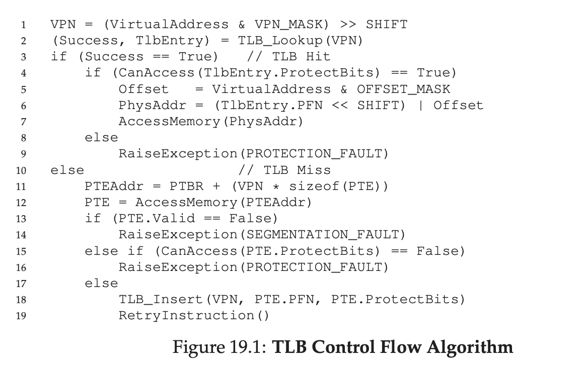
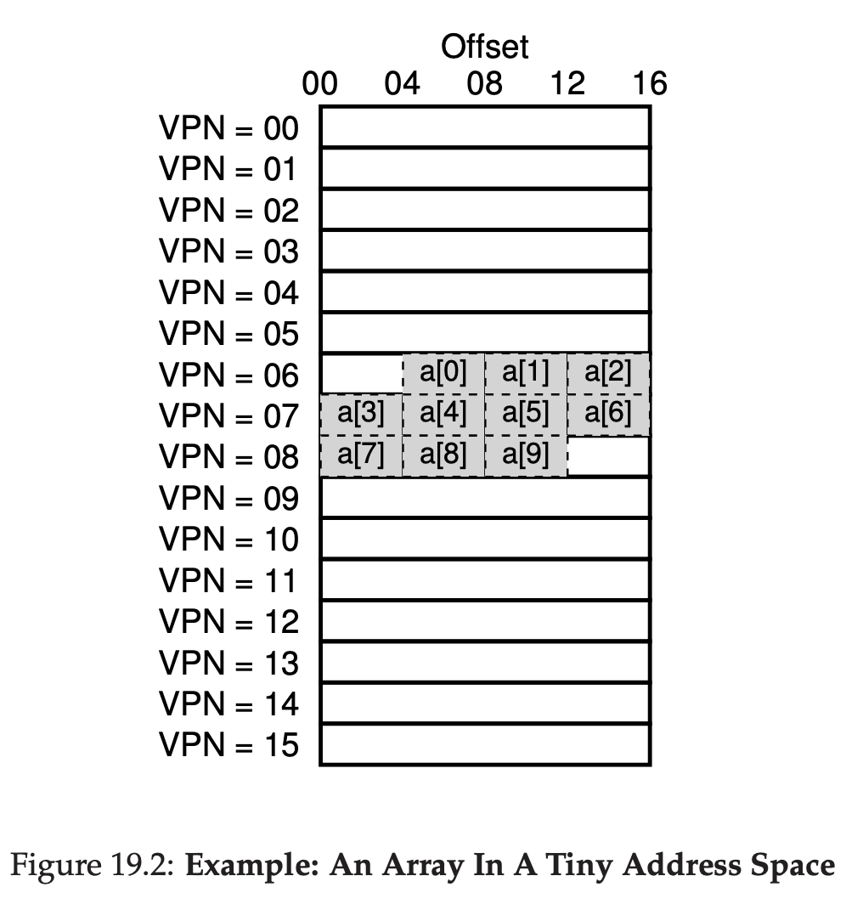
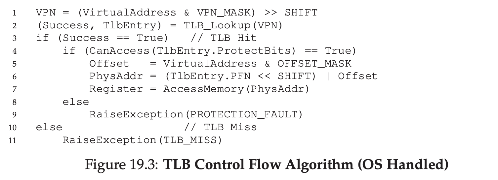
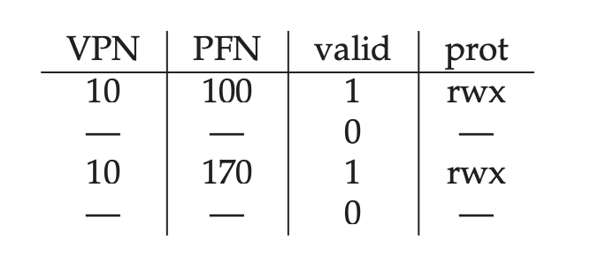
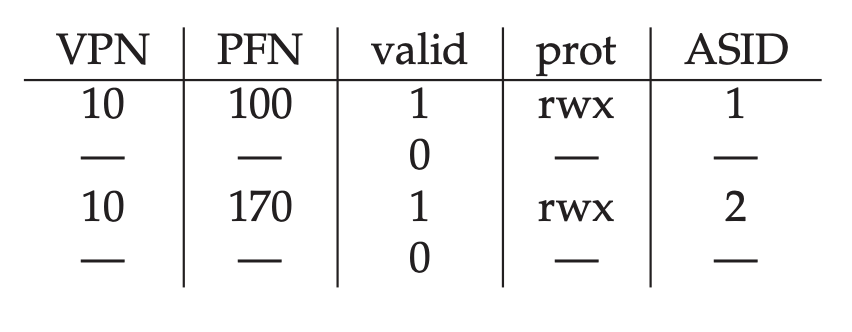
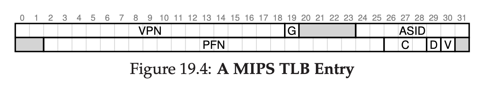

# Paging: Faster Translations (TLBs)

Using paging as a core mechanism can be bad, because paging need an extra memory to lookup for every instruction.

To speed up address translation, a hardware need a helper. We're going to add **Translation lookaside buffer (TLB)**. TLB is a part of Memory Management Unit (MMU), it's a hardware cache to store popular virtual to physical address translation.

Each virtual memory reference, hardware will check TLB first if it's already cached, if it's cached, the hardware can just use that cached physical address to fetch the data.

## TLB Basic Algorithm

- Extract the virtual page number from virtual address
- Check the TLB if it's cached the VPN
- If yes, TLB hit, means can get Page Frame Number (PFN)
- Concantenate PFN with Offset to get Physical Address
- Access memory

If CPU doesn't find translation in TLB, it will do a costly action, and put the translation to TLB.

If TLB miss happen often, the application will run slowly.



## Example: Accessing an array

In this example, let's assume there's an array of 10 4 byte integer in memory, starting at virtual address 100.

We have small 8 bit of virtual address space.

With 16 bytes of pages

That means, 4 bit for VPN, and 4 bit for offset.



As you can see, the array first entry (a[0]) begin on VPN 6, offset 4. That means only 3 integer can fit in this page.

Then on next 4 entries, a[3] - a[6] is on VPN 7. Then last 3 a[7] - a[9] is on VPN 8.

Let's consider this simple loop
```
int sum = 0;
for (i = 0; i < 10; i++) {
    sum += a[i];
}
```

For simplicity, let's pretend only memory access is the array, ignoring code, int i, int sum.

When accessing a[0], CPU will load virtual address 100. The hardware will extract that into VPN 6, and check the TLB for that translation, the result is TLB miss.

Next access is a[1], but this time, it's TLB hit because we already accessed this page, so the translation is inside the TLB.

Accessing a[2] also TLB hit.

Accessing a[3] will TLB miss, but a[4-6] will TLB hit.

Accessing a[7] will TLB miss, but a[8-9] will TLB hit.

The TLB hit rate will be 70%.

The TLB improve the performance because **spatial locality**.

The elements of the array are packed tightly into pages, that means the TLB miss only when first time getting the pages.

If the pages is more bigger, that means the TLB miss will be decreased because there's a high chance it will be on the same pages.

If we do the same loop after we done looping, the TLB miss will most likely zero. Because all of the pages already cached in the TLB. It's called temporal locality.

## Who Handles The TLB Miss?

In olden days, it was Hardware who handles that, that means, hardware need to know where exactly the page tables resides in memory (via page table register).

Now, more modern architecture is using **software managed TLB**. On TLB miss, hardware raise an exception which pauses the instruction stream, raise the privilege to kernel level, and trigger trap handler.

After that, it will read the missed page, and it will update the TLB, and rerun the instruction.

The primary advantages software managed TLB is flexibility, OS can use any data structure to handle the page table without relying the hardware. Other reason is simplicity



##  TLB Contents: What’s In There?

A typical TLB might have 32, 64, 128 entries. Basically any given translation can be anywhere in TLB. And hardware will search in TLB in parallel to find the translation.

Inside TLB entry might look like this

```
VPN | PFN | other bits
```

For other bit, for example **protection bit**, how the page can be accessed.

Code page usually can only read & execute

Heap page usually can only read & write.

## TLB Issue: Context Switches

TLB contains translated virtual to physical address of the page that only valid on the currently running process.

That means other process doesn't have any meaning to this data except the owning process.

### Example

When P1 process is running it will assume TLB will cache the respective virtual-physical address.

Let's assume 10th virtual page address of P1 is mapped to physical frame number 100.

Then P2 comes, and OS decided to context switch to P2 now.

Let's assume P2 also use 10th virtual page. And it's mapped to physical frame number 170.



In this image, TLB doesn't know which translation belong to whom.

One approach is to flush all of the TLB when doing context switch.

That means making all of the content's valid value to 0.

But, flushing TLB means every context switch will get TLB miss. Which is affect performance.

To reduce this overhead, we can add a new bits called **Address space identifier (ASID)**, basically it's like PID but less bits (8 vs 32).



## Issue: Replacement Policy

When we add new entry on TLB, we need to replace the old one, because if we're not replacing the old one, the TLB will be full.

One common approach is to do LRU (least recently used).

Another typical approach is do random pick.

## A Real TLB Entry

For example we take from MIPS
R4000.



It's support 32 bit address with 4KB of page size. That means, we will expect 12 bit of offset, and 20 bit of VPN.

But if you see on the image, there only 19 bit of VPN.

Turns out, user address space only took half the address space, and the rest is kernel owned.

As you can see on the image, the PFN took 24 bit, that means it can support up to 64GB of memory (2^24 * 4KB page size).

We can see a global bits (G), that is for a flag it can be globally avaiable through process, if global bit is 1, ASID will be ignored.

We can see ASID bit also.

We can see coherence (C) bits also.

We can see dirty bit (D) also.

We can see valid bit (V) also.

Some of the bits are unused (shaded gray).

## Summary

To make paging faster, we need TLB.

TLB is basically a cache for mapping the virtual address -> physical address.

If OS can't find the mapping in TLB, we call it TLB miss (Cache miss). Otherwise, it's TLB hit (cache hit).

We want to get TLB hit as much as possible, because if there's too many TLB miss, the performance will degrade.