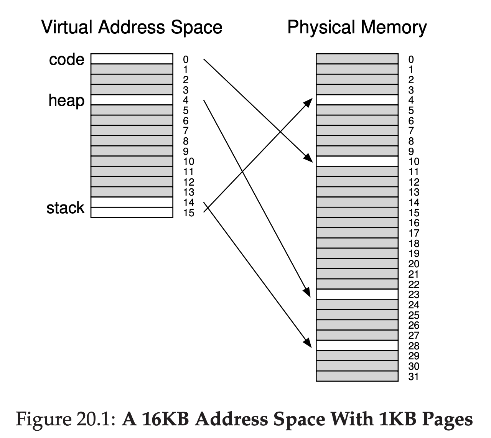
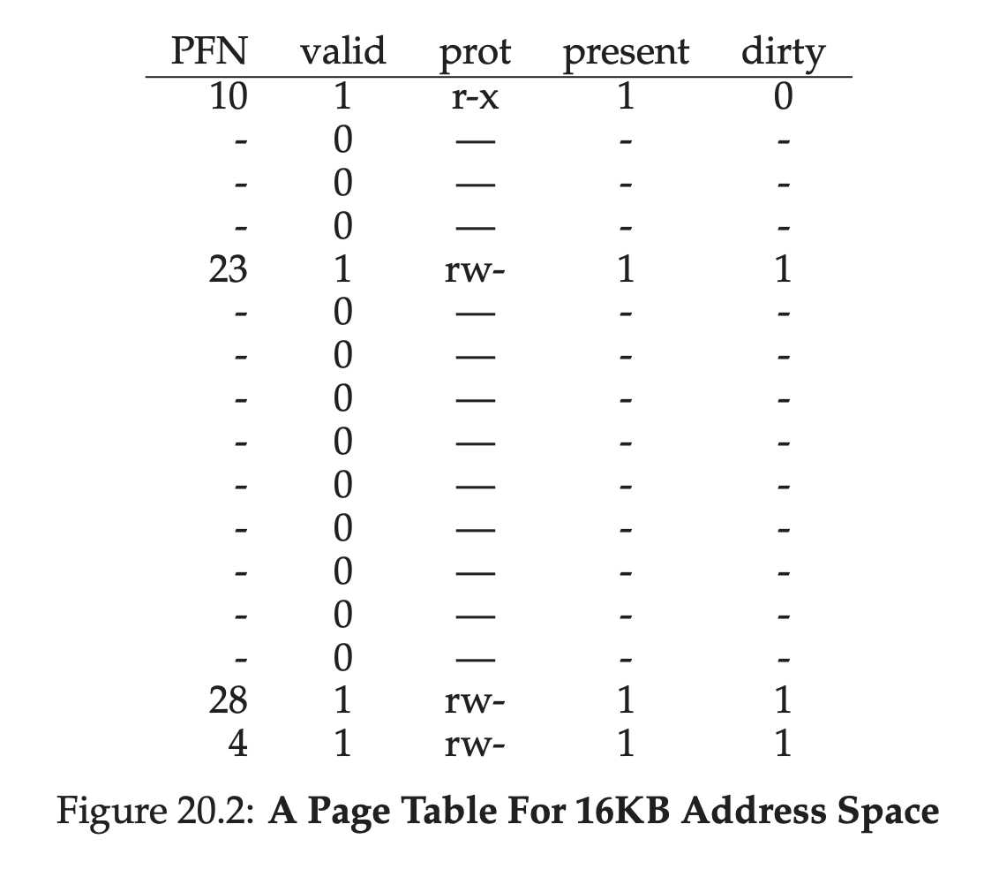
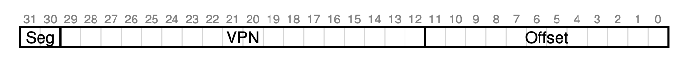
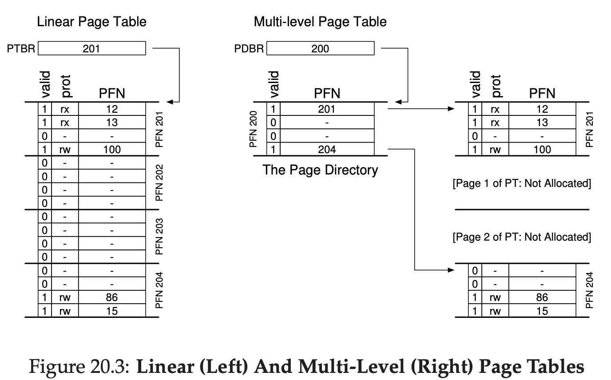
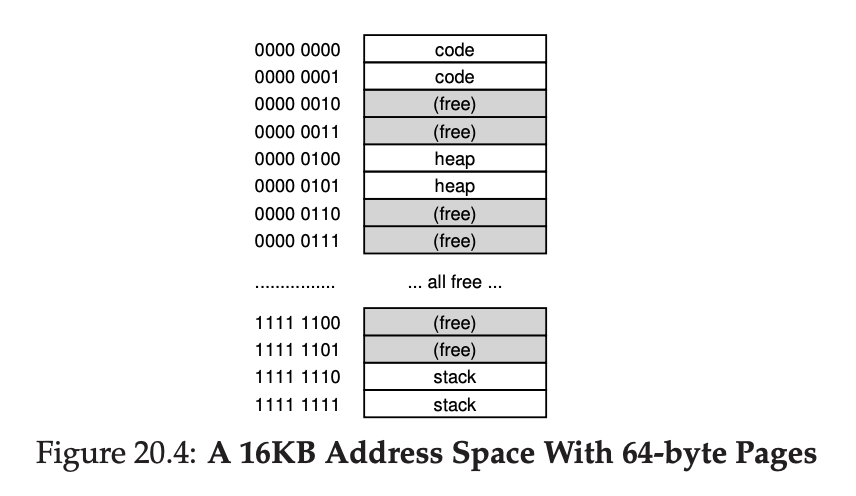

# Paging: Smaller Tables

Previously, we use TLB to speed up the lookup of the translation between virtual address -> physical address.

Now we will try to solve the big page table issue.

## Simple Solution: Bigger Pages

We can just increase the page into a bigger one, assuming previous page is 4KB, now we use 16KB. That means we only need to have 1MB of page table.

The problem is, bigger page means higher risk of internal fragmentation.

## Hybrid Approach: Paging and Segments

Assuming we have an address space that use some portion for stack and heap that are small.

Example: we have 16KB address space with 1KB pages.

This example assumes single code page (VPN 0) is mapped at PFN 10

Single heap page (VPN 4) is mapped at PFN 23

And two stack page (VPN 14 & 15) is mapped at 28 and 4

As you can see, from 16KB address space, only used 5KB.

Imagine if it's 32 bit address space, the waste will be a lot.

For our hybrid approach, instead of having 1 page table for whole user space, why not have page table per logical space? That means we will have 3 page table, for heap, stack, code.

Same with previous segmentation, we will have base and bound.

But, we use base not to point to the segment, but we point it to physical address of the page table of that segment.

Bound register is to tell the end of the page table.

### Example

Assume 32 bit virtual address with 4KB of pages size. Per address space have 4 segment. But we only use 3, code, heap, stack.

To determine which segment we will use, we can use top 2 bit. Let's assume bit 00 is not used.

01 for code

10 for heap

11 for stack

The difference between previous approach is the presence of bound.

That means, if code segment is using first 3 pages (1, 2, 3). Code segments table only have 3 entries allocated.

However, the approach requires segmentation, which is not quite flexible.

Also, external fragmentation problem will raise again.

For this reason, we need to find another approach.

## Multi-level Page Tables

How to get rid of invalid region in page table instead of keeping it in memory? **Multi level page table**

The concept is simple.

- Chop up the page table into page-sized unit
- If the entire entries of that page table is invalid, don't allocate that page at all.
- To track the page table is valid / not & find out where the location, use a data structure called page directory.

Page directory will consist of several Page Directory Entries (PDE).

Per 1 Page Directory Entries, at least have 2 things valid bit, and PFN location for that page table.

### A Detailed Multi-Level Example

Imagine small address space of size 16KB, with 64 byte page size.

16KB is 16384

16384 / (64 * 8) = 256

We need 8 bit to get 256 VPN

And 6 bit to get (64 * 8) offset

In this example, virtual page 0 and 1 are for code.

Virtual page 4 and 5 are for heap.

And virtual page 254 and 255 is for stack.

