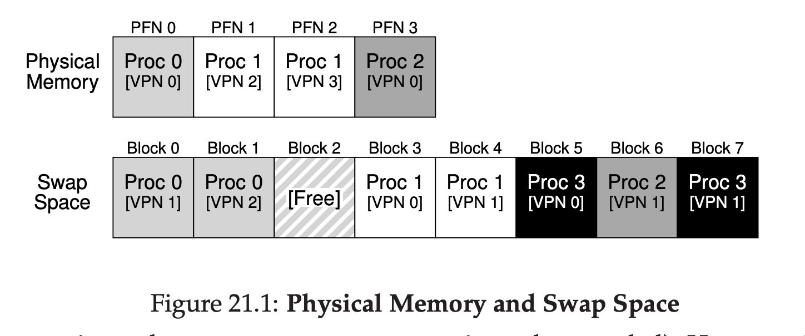
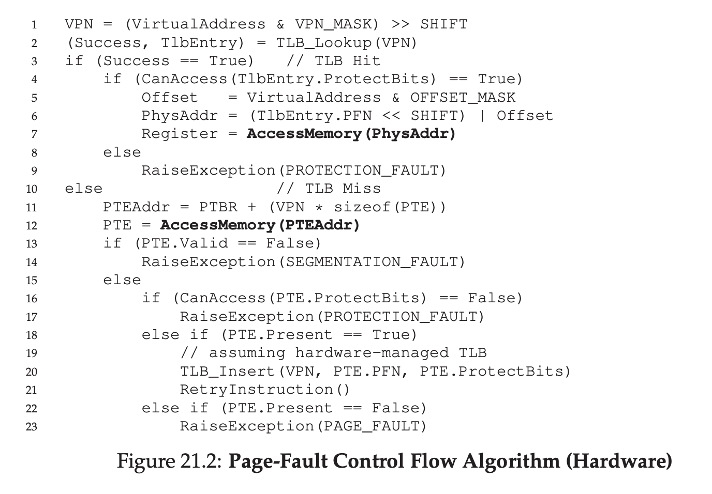
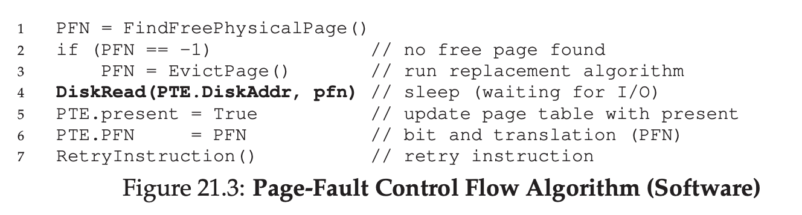

# Beyond Physical Memory: Mechanisms

What will OS do when memory is full and want to add more user space?

OS can actually use a disk to stash away unpopular process

The reason it's using disk because it's more larger than memory, but it's slower than memory.

## Swap Space

We need a space in the disk to move the page back of forth, we call it swap space.

## The Present Bit

Let's remind ourself about TLB.

If cache hit, continue like usual.

If not, check on the page table, but this time, check on present bit also, is it present in the memory or it's been swapped to disk?

If process accessing page that's not present, it's called page fault.

## The Page Fault

If page fault happens, OS page fault handler will run to deal with it.

If page is not present on memory, OS will need to swap the page into memory in order to deal with page fault, but how do OS know which page should be swapped?

The location can be put on the page table, especially on the PFN.

That means, the OS will issue an I/O to the disk, when the I/O is completed, the OS then:

- Update the page table entry to mark it as present
- Update the page table entry on PFN
- Retry the instruction

Then, when retry happened, it will have TLB miss, that means it will translate the virtual -> physical, then retry instruction again.

Then, TLB hit, and process running like normal.

While I/O is happening, process will be on blocked state, that means the OS will do another process while waiting.

## What If Memory Is Full?

Previously we assume the memory of swap space is plenty, if memory of swap space is not enough.

We need to page out one or more pages to make room for new page that will come.

The process of page out / in is called page replacement policy.

If we do it incorrectly, the impact will make the process run slowly, so we need to be wise about this.

## Page Fault Control Flow

## When Replacements Really Occur

OS will try it best to keep small memory free, so it can be used to page in the new page.

To keep small memory free, most OS will have some kind of **High Watermark (HW)** and **Low Watermark (LW)** to help decide when to start removing page from memory.

This is how it works:

There's a background thread that will check LW pages available, if it's avaiable, the **swap daemon** or **page daemon** will try to remove those in memory, until there are HW pages avaiable.

Swap daemon then will go to sleep after that.

## Summary

Page can make memory full, if the memory is full, process can't be added.

In order to mitigate this, OS can put the page from memory into disk.

To make OS know which page is already putted on disk, we will have present bit on out page table.

Sometimes, the disk can also be full because of swapping, if this happens, we need to find a way to remove some pages so we can fill it with another page.

One solution is to use HW and LW, and let the page daemon remove the LW so the HW can go in to the disk.