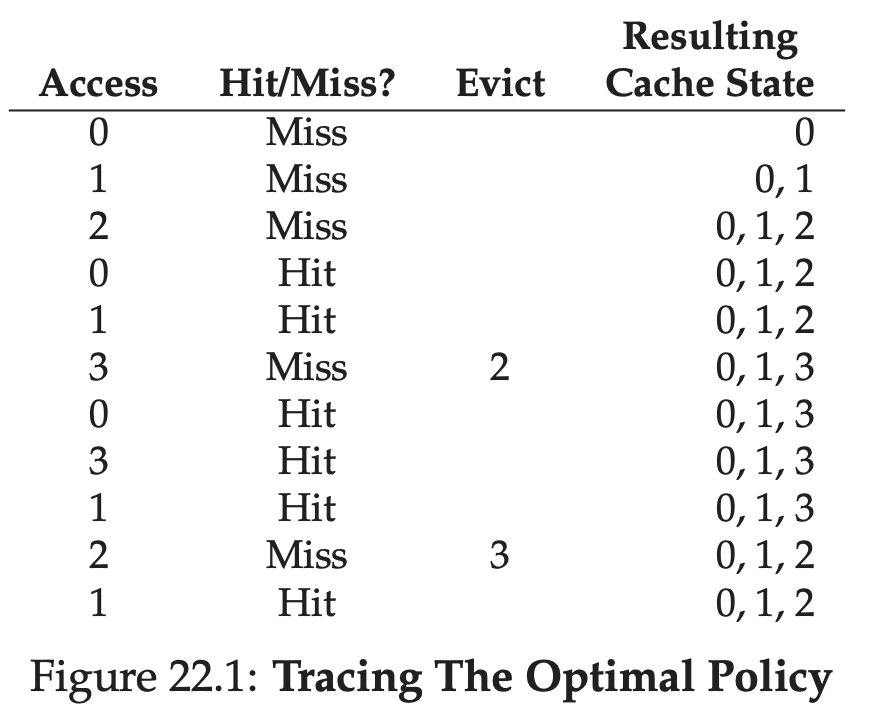
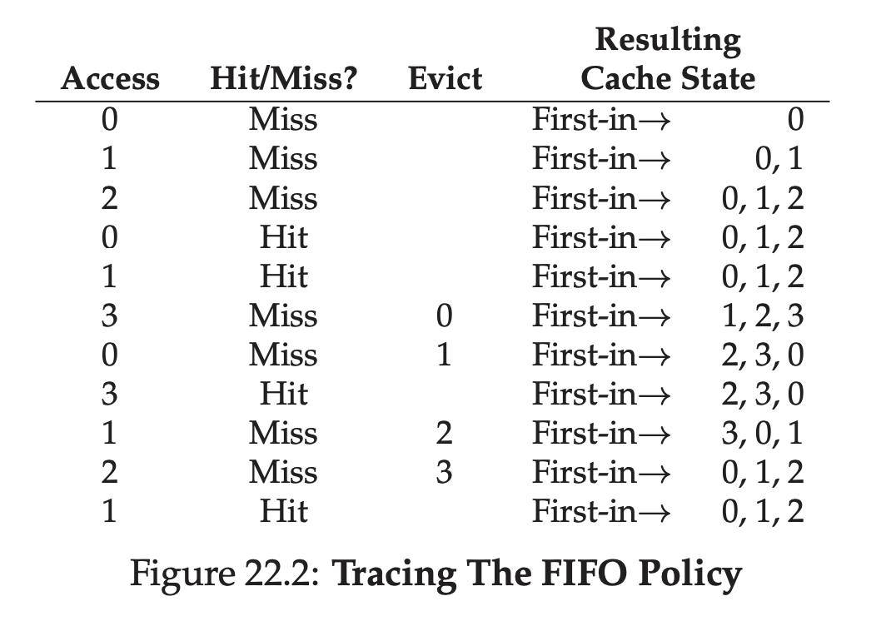
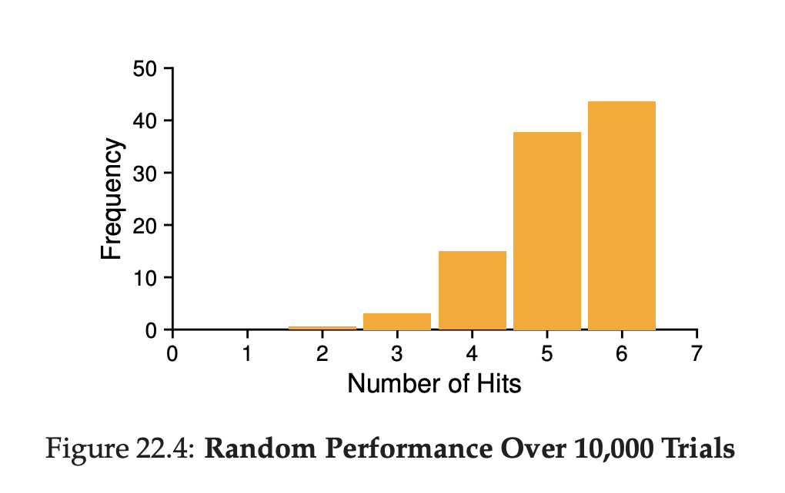
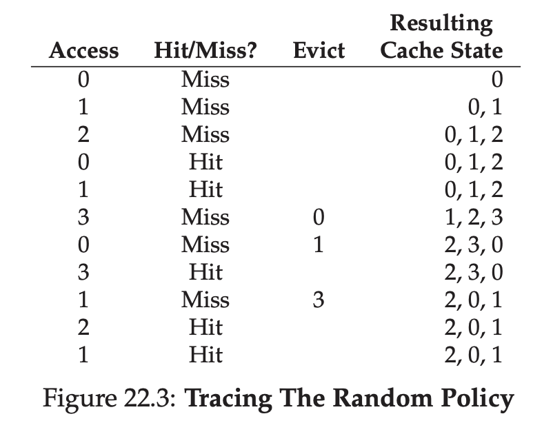
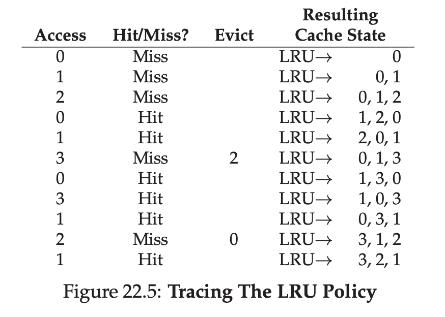
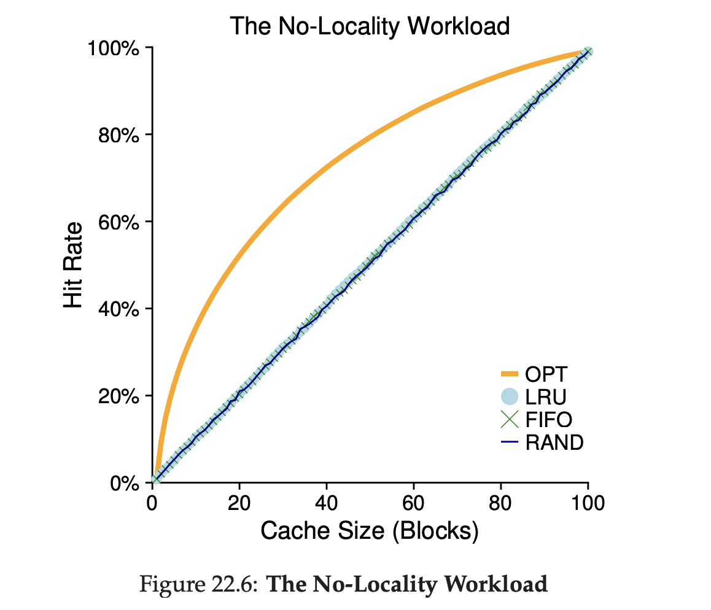
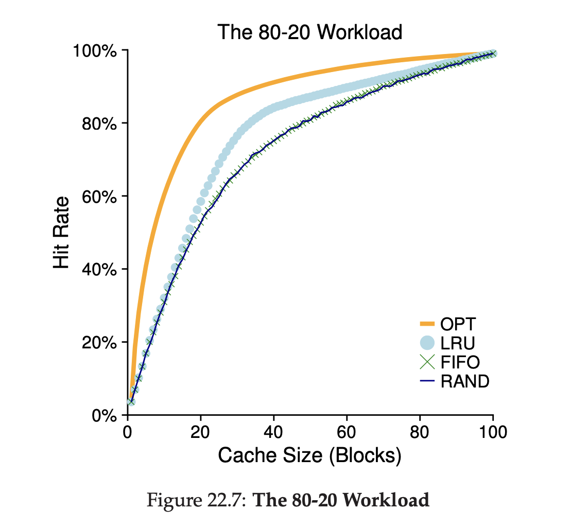
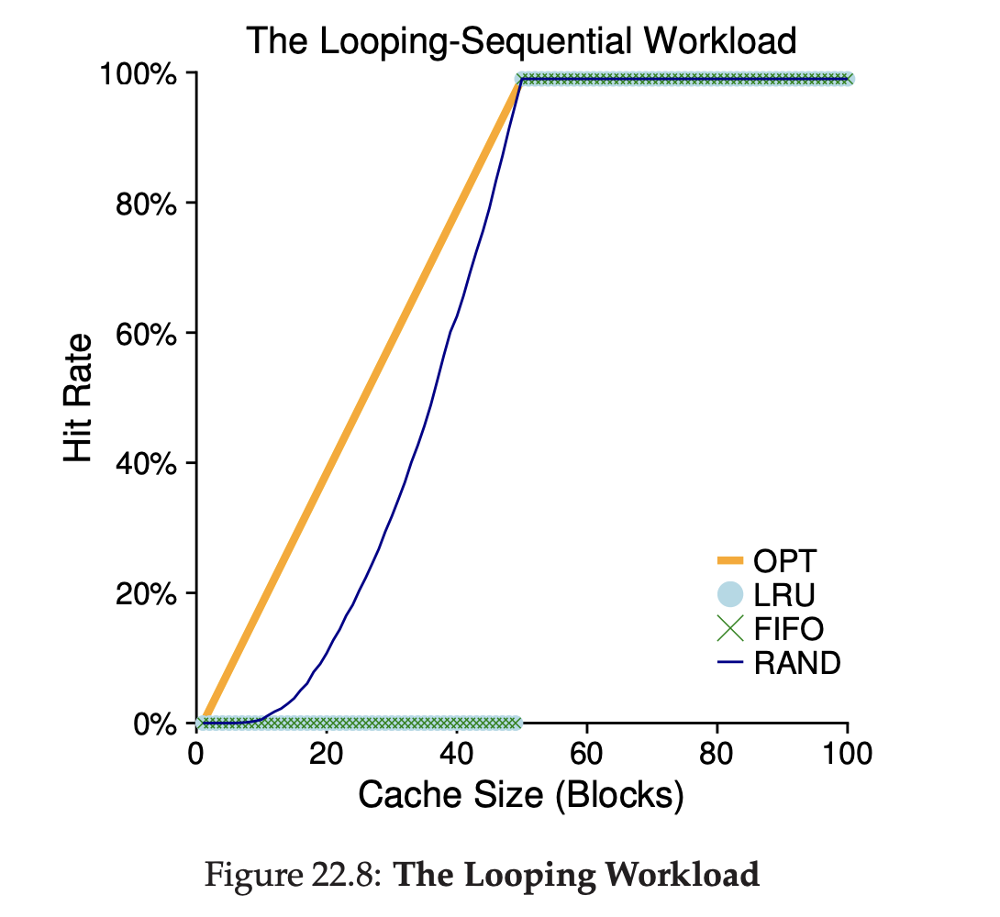

# Beyond Physical Memory: Policies

How OS choose which pages should be kicked out from memory?

## Cache Management

The memory that contain page right now can be seen as a cache.

Our goal to make sure the page got kicked out not frequently making it "cache miss"

That means, we need to increase our cache hit rate

AMAT = Average Memory Access Time

<i>AMAT = ( P<sub>hit</sub> * T<sub>M</sub> ) + ( P<sub>miss</sub> * T<sub>D</sub> )</i>

T<sub>M</sub> = Cost accessing memory

T<sub>D</sub> = Cost accessing disk

P<sub>hit</sub> = Probability finding the data item in cache (cache hit)

P<sub>miss</sub> = Probability not finding the data item in cache (cache miss)

P<sub>hit</sub> + P<sub>miss</sub> = 1.0

### Example

Machine has tiny address space, 4KB

Page size is 256 bytes.

Page size will require 8 bit because pow(2, 8) = 256

VPN need 4 bit, because 4KB / 256 = pow(2, 4) = 16

A process generates the following memory references, these is the first 10 pages.

```
0x000, 0x100, 0x200, 0x300, 0x400, 0x500,
0x600, 0x700, 0x800, 0x900
```

Let's assume every page **except** the `0x300` is already on the memory.

That means the sequence of the cache hit / miss is

```
hit, hit, hit, miss, hit, hit, hit, hit, hit, hit
```

P<sub>hit</sub> = 0.9
P<sub>miss</sub> = 0.1

Assuming

T<sub>M</sub> = 100 nanosecond
T<sub>D</sub> = 10 millisecond

AMAT: 0.9 · 100ns + 0.1 · 10ms, which is 90ns + 1ms, or 1.00009 ms

If our hit rate is 99.9%, the data would be different, it would be:

10.1 microseconds

Which is 100x faster.

## The Optimal Replacement Policy

Optimal policy intuition is simple, if want to throw some page, throw the most furthest use from now.

But because nobody knows the future, we can't build this policy in general purpose OS.



## A Simple Policy: FIFO

FIFO is easy to implement.



## Another Simple Policy: Random

It's simply take a random page to kick out.

Same like FIFO, it's easy to implement

Random does a little better than FIFO, and a little worse than optimal.





## Using History: LRU

FIFO or Random has the same problem, it can kick out the important page.

We need to use history of the past to decide which page should we kick, example: if the page was used recently, it has a bigger chance it will used again in the future.

One type of data we can use is **frequency**. It the page is accessed very frequent, it's a sign we don't want to kick out this page.

Because of that, LRU (Least Recently Used) & LFU (Least Frequently Used) come.



## Workload Examples

Let's test with some scenario, first scenario is we access an address that has no locality, literally random.



If you see the graph, no matter what algorithm you use, if there's no locality, all algorithm perform the same.

Second, when the cache is large enough to fill  all of the workload, all algorithm perform the same.

Next workload is the 80-20 workload.

That means, 80% of reference that got called, is from 20% cold reference.



As you can see, the LRU performs better in here.

Let's look at final workload, which is looping sequential. As you can see, the LRU and FIFO perform worst, and Random algorithm do well in here.



## Considering Dirty Pages

If pages already been modified, but it's different vs on the disk state. It's considered as dirty.

That means you need to update on the disk as well. It's slower

We can consider just evict the clean page, because we don't need to do disk I/O on clean page.

## Other VM Policies

Page replacement policy is not only way OS do, OS can also consider when to put page into memory, it's called page selection policy.

For most pages, OS can do demand paging, that means OS bring page into memory on-demand.

So OS will guess some page will be used in the future, it's called prefetching.

Another policy is how OS write to disk, OS prefer to write into disk a lot at a time, this behavior called clustering / grouping writes. It's working because disk behavior more perform when doing large write vs single write multiple times.

## Thrashing

What should OS do when memory is oversubscribed and process that currently running is exceeding the capacity of physical memory? It's called thrashing

Some earlier OS has some kind of detection and handle the thrashing, they can decide not to run some kind of process with hope the process will end and give space to another process, this process called admission control.

Some OS just kill the process when out of memory, but it's kinda bad because what if the killed process is a server?

## Summary

In order to do kicking out the page, OS has some kind of policy.

But in the end, it's all about the cache size and code locality. If the cache size and code locality is bad. No matter what algorithm you use, the result will be bad.