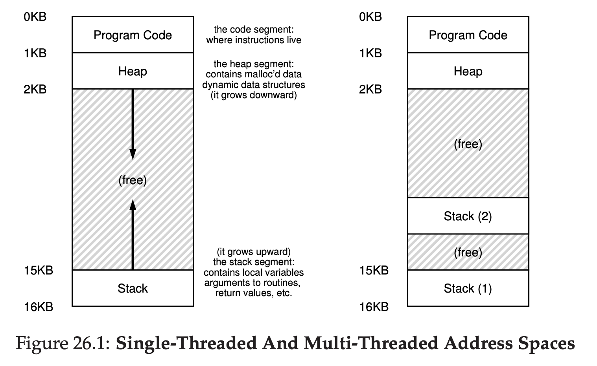
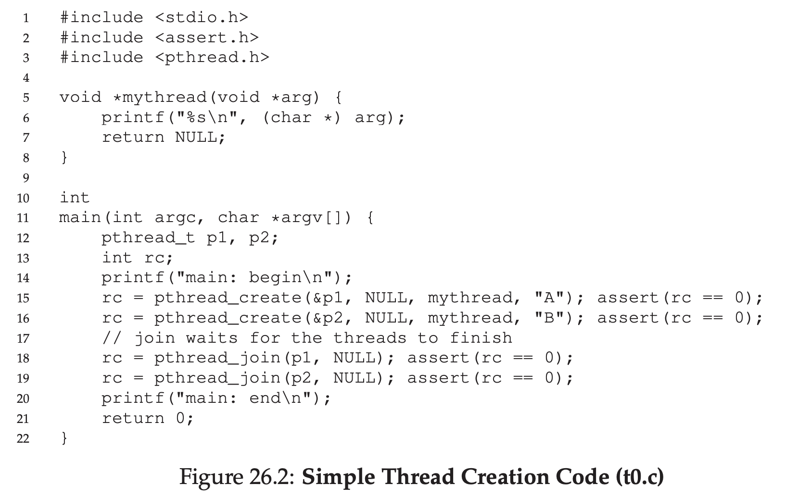
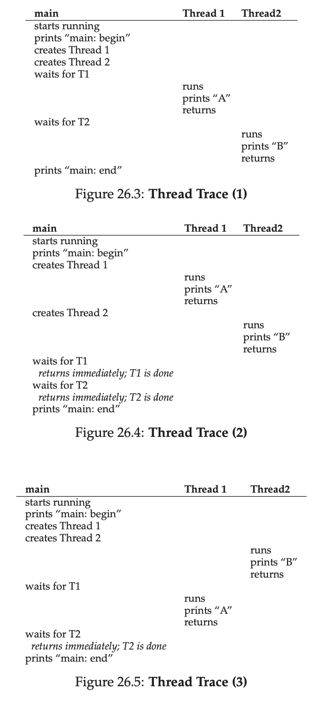
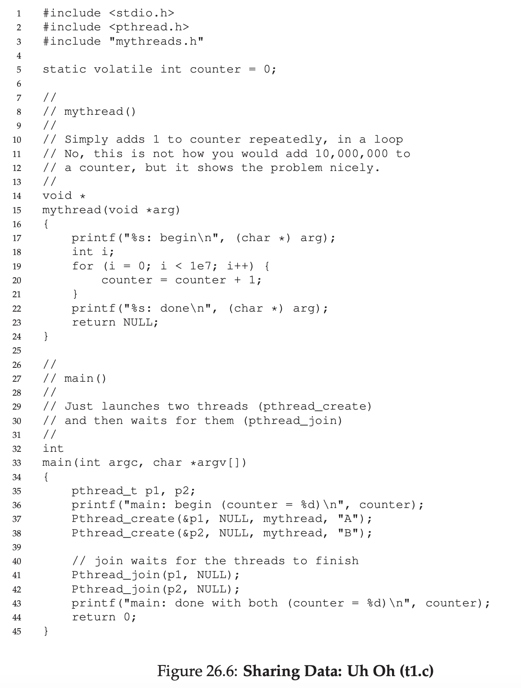
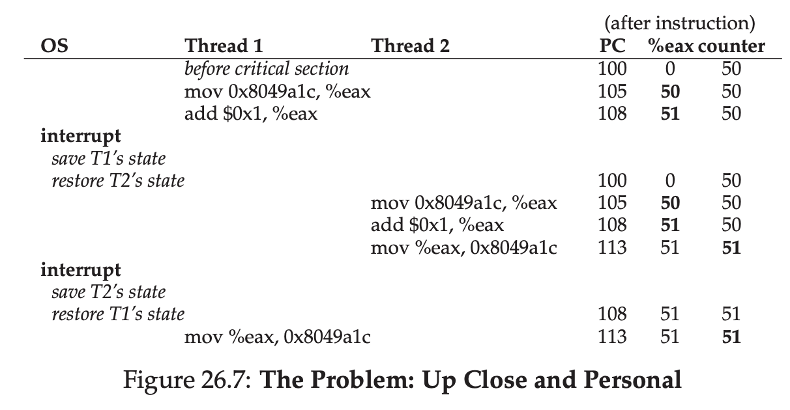

# Concurrency: An Introduction

Thread is different vs process.

Thread has multiple point of execution (multiple PC).

Thread looks like a separate process, but it shares the user space, that means it shares the data aswell.

On thread, it has it's own program counter (PC).

On thread, it has it's own private register to use for computation.

That means, if two thread that is running on single processor, when switching is happening, a context switch will happen.

Context switch between thread is almost the same like process. Because it need to save the state on register also.

In process, we save the state in Process Control Block (PCB). In thread, we save it in the Thread Control Block.

The major difference when doing context switch in thread, the address space remains the same, that means no need to switch which page table we are using.

One other major differences is the stack of multithreaded application is one per thread.



## An Example: Thread Creation

Let's say you want to run a program that is running 2 thread.

One that printing "A".

One that printing "B".

Main program will create two threads, each of them will run the function `mythread()` with different argument

Once a thread is created, it will start running right away (it actually depend on the scheduler)

It may put on `ready` state.

After creating two threads (T1, and T2), main thread will call `pthread_join()` which wait for a particular thread to complete.



This is the flow will looks like



## Why It Gets Worse: Shared Data

Let's imagine there's two thread that wish to update a global shared variable.



```
15 void *mythread(void *arg)
16 {
17  printf("%s: begin\n", (char *) arg);
18  int i;
19  for (i = 0; i < 1e7; i++) {
20      counter = counter + 1;
21  }
22  printf("%s: done\n", (char *) arg);
23  return NULL;
24 }
```

If you see on the code, it will try to loop 1e7 times, adding the counter. Because we have 2 thread that call this function. The expected final value should be 2e7.

We run it, and see the result

```
prompt> gcc -o main main.c -Wall -pthread
prompt> ./main
main: begin (counter = 0)
A: begin
B: begin
A: done
B: done
main: done with both (counter = 20000000)
```

Sometimes, the result is expected.

But when we run it again, sometimes it's not.

```
prompt> ./main
main: begin (counter = 0)
A: begin
B: begin
A: done
B: done
main: done with both (counter = 19345221)
```

If we run it again, it's different

```
prompt> ./main
main: begin (counter = 0)
A: begin
B: begin
A: done
B: done
main: done with both (counter = 19221041)
```

## The Heart Of The Problem: Uncontrolled Scheduling

This is the reason it happens.

When counter is added by one,under the hood is like this

```
mov 0x8049a1c, %eax
add $0x1, %eax
mov %eax, 0x8049a1c
```

It will put the value from memory to register

Then register will add 1

From register, it will put the value to memory again

The problem is, if Thread 1 got context switch before finishing the 3 of those instruction and Thread 2 take place.



