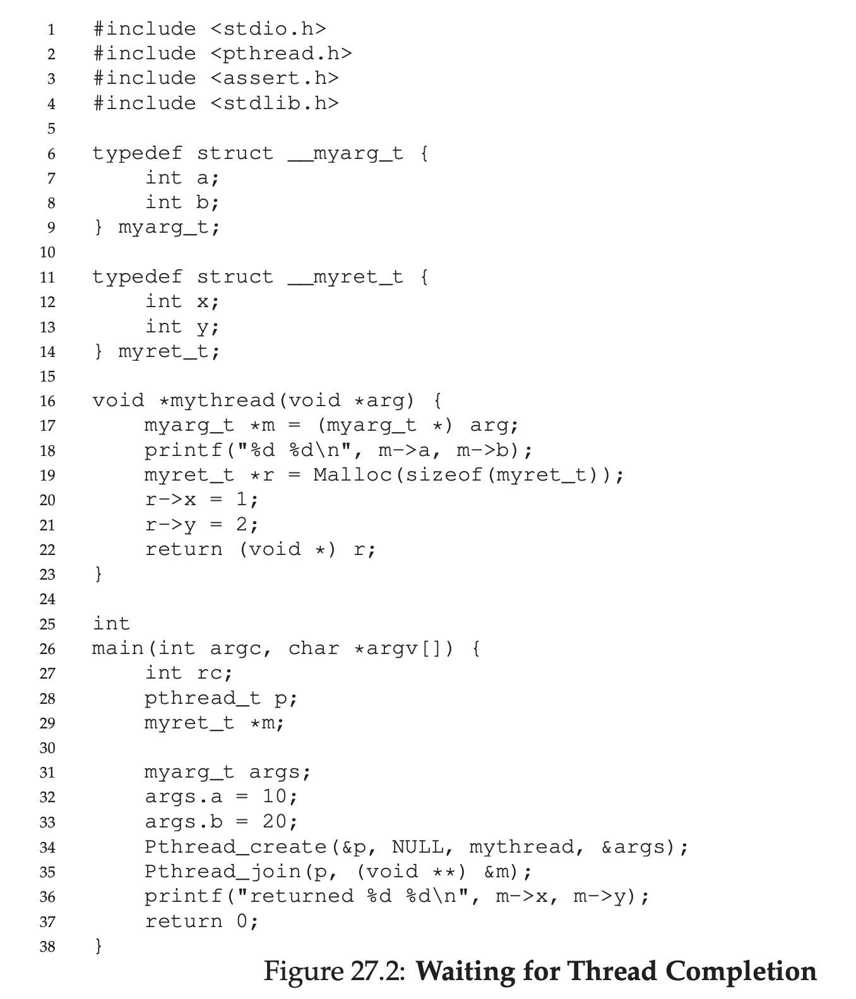
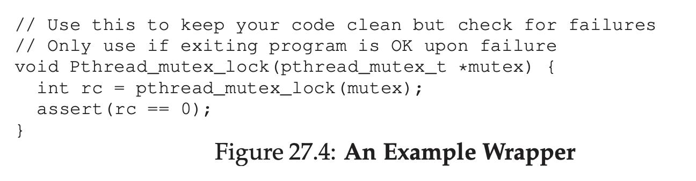

# Interlude: Thread API

## Thread Creation

First thing to write a multithreaded apps is to create a thread.

```
#include <pthread.h>
int pthread_create(pthread_t * thread, const pthread_attr_t * attr, void * (*start_routine)(void*), void * arg);
```

First argument is `pthread_t *thread`, is a pointer of a thread.

Second argument is `attr`, is to specify any attribute this thread might have. For example setting the stack size or maybe scheduling priority for this thread. Attribute is initialized using `pthread_attr_init()`, however usually default value is okay.

Third argument is which function should a thread start running in.

Fourth argument is args of the function.

## Thread Completion

What should you do to wait for completion of a thread?

We can use `pthread_join()`

```
int pthread_join(pthread_t thread, void **value_ptr);
```

This function take 2 arguments.

First is `pthread_t` which thread you want to wait

Second is a return value that got returned from function thread.



Never return a value that resides in stack. Always from heap.

## Locks

Lock can be useful to provide mutex.

```
int pthread_mutex_lock(pthread_mutex_t *mutex);
int pthread_mutex_unlock(pthread_mutex_t *mutex);
```

```
pthread_mutex_t lock;
pthread_mutex_lock(&lock);
x = x + 1; // or whatever your critical section is
pthread_mutex_unlock(&lock);
```

If no other thread hold the locks when `pthread_mutex_lock()` is called, the thread will acquire the lock.

If another thread already acquire the lock, it cannot go in until the owner of the lock release the lock.

Lock must be intialized

```
pthread_mutex_t lock = PTHREAD_MUTEX_INITIALIZER;
```

Or
```
int rc = pthread_mutex_init(&lock, NULL);
assert(rc == 0); // always check success!
```

The problem with this code is, the initialization of lock is not always works. The routine can also fail, if code doesn't check the error, the apps can fail silently.



Lock and unlock are not the only one we can use, there's also

```
int pthread_mutex_trylock(pthread_mutex_t *mutex);
int pthread_mutex_timedlock(pthread_mutex_t *mutex, struct timespec *abs_timeout);
```

Try lock will return error if the lock already held by other thread

Timed lock will become try lock if time runs out.

Both of these should be avoided, but there's a case where we need it.

## Condition Variables

This is useful to give signaling between thread

```
int pthread_cond_wait(pthread_cond_t *cond, pthread_mutex_t *mutex);
int pthread_cond_signal(pthread_cond_t *cond);
```

`pthread_cond_wait` make the thread go to sleep.

`pthread_cond_signal` make the sleeping thread wake up

```
pthread_mutex_t lock = PTHREAD_MUTEX_INITIALIZER;
pthread_cond_t cond = PTHREAD_COND_INITIALIZER;
Pthread_mutex_lock(&lock);
while (ready == 0)
    Pthread_cond_wait(&cond, &lock);
Pthread_mutex_unlock(&lock);
```

When `Pthread_cond_wait` happens, it also release the lock.

```
Pthread_mutex_lock(&lock);
ready = 1;
Pthread_cond_signal(&cond);
Pthread_mutex_unlock(&lock);
```

Actually, you might wondering why we can't just do this instead

```
while (ready == 0)
; // spin
```

```
ready = 1;
```

But please don't do this, this will spinning for long time and waste CPU cycles.

## Compiling and Running

When you want to compile the code, you need to explicitly link it with pthread library using `-pthread` flag

```
prompt> gcc -o main main.c -Wall -pthread
```