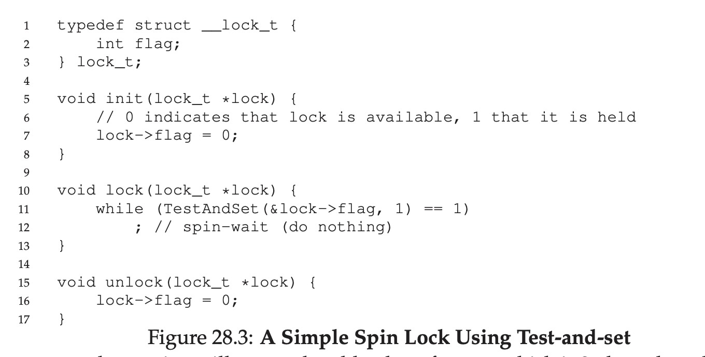
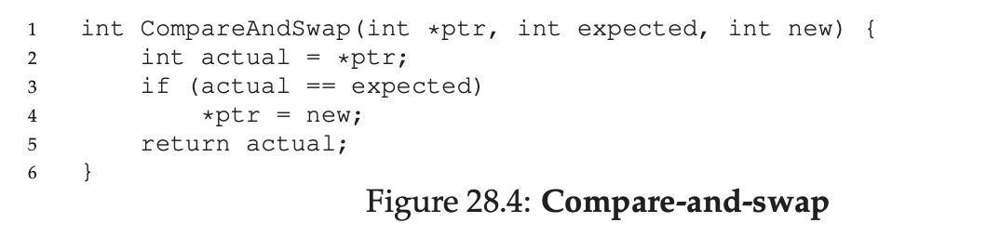
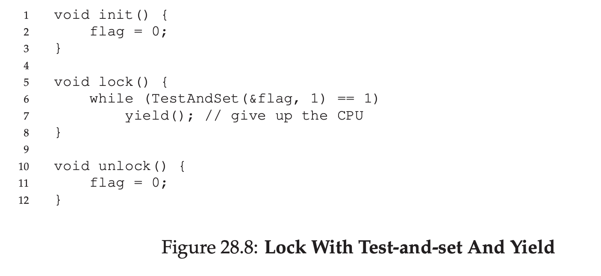

# Locks

## Locks: The Basic Idea

To use a lock, you do something like this

```
lock_t mutex; // some globally-allocated lock ’mutex’
...
lock(&mutex);
balance = balance + 1;
unlock(&mutex);
```

Lock is just a variable, and lock holding a state of it. It's either free or locked. Only 1 thread can hold the lock.

We could also store more information there, such as which thread who hold the lock, or maybe queue for ordering lock acquisition, but usually it's hidden from the user.

`lock()` and `unlock()` are very simple, calling `lock()` will try to acquire lock, if no other thread hold the lock, thread will acquire it and enter critical section

If other thread already acquire the lock, that thread can't go into the critical section.

Once the owner of the lock call `unlock()` the lock is now available again. If there are waiting threads, one of them will eventually take the lock and go to critical section, some of the implementation also notify the waiting thread.

## Building A Lock

To build a working lock, we will need hardware support and also OS support. 

## Evaluating Locks

### Requirement

Lock must give us a mutual exclusion, basically does the lock works, preventing multiple thread to go into critical section.

### Fairness

Does each thread that want to get the lock get a fair chance?

### Performance

There are 3 cases for this.

- When there's no contention, when single thread is running, and grab and release lock, is the overhead really bad?

- When multiple thread is contending

- When there's multiple CPU

##  Controlling Interrupts

One of the earliest solution is to control the interrupt for locking

```
1 void lock() {
2   DisableInterrupts();
3 }
4 void unlock() {
5   EnableInterrupts();
6 }
```

This is for single processor system.

The positive things of this is simplicity

The negative things is so many.

This can be abused because it's using privileged access to control interrupt.

Second, this won't work on multiprocessor system.

## Building A Working Spin Lock

First, we need some kind of atomically function that supported by hardware

```
1 int TestAndSet(int *old_ptr, int new) {
2   int old = *old_ptr; // fetch old value at old_ptr
3   *old_ptr = new; // store ’new’ into old_ptr
4   return old; // return the old value
5 }
```

This should be run atomically.



## Evaluating Spin Locks

For correctness, the spin lock can works in here

For fairness, unfortunately can't guarantee because the spin lock doesn't know which thread that on first position.

For the performance, it's also bad since it will doing empty looping again and again, waste of CPU cycle.

## Compare-And-Swap

We need an atomically function that works like this



But for the Fairness and Performance, it's kinda same like Spin lock

## Too Much Spinning: What Now?

Actually there's more to how to implement locks, but I skip it because the rest also requiring spinning, which is bad for CPU cycle.

## A Simple Approach: Just Yield, Baby

Instead of doing spin, we can just let thread yield it or force to context switch.



Yield basically move the thread state from running to ready.

## Using Queues: Sleeping Instead Of Spinning

If the scheduler makes a bad decision, the performance can still be bad too.

Because what if the scheduler always pick the thread that doesn't have the lock? That means all of the computation will be on the spinning / yielding

Because of this, we need an OS support, we need to have 