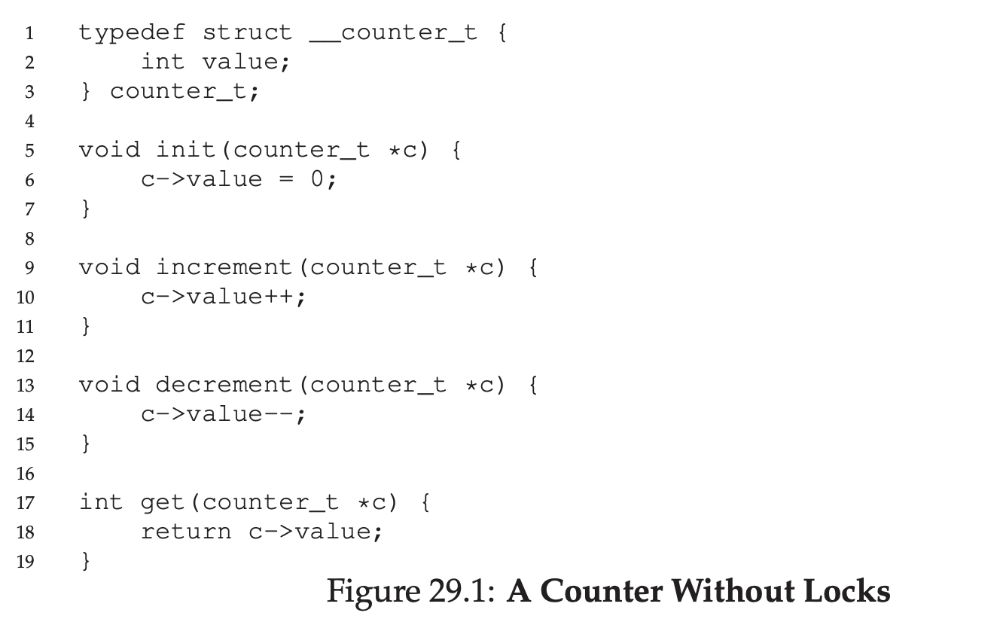
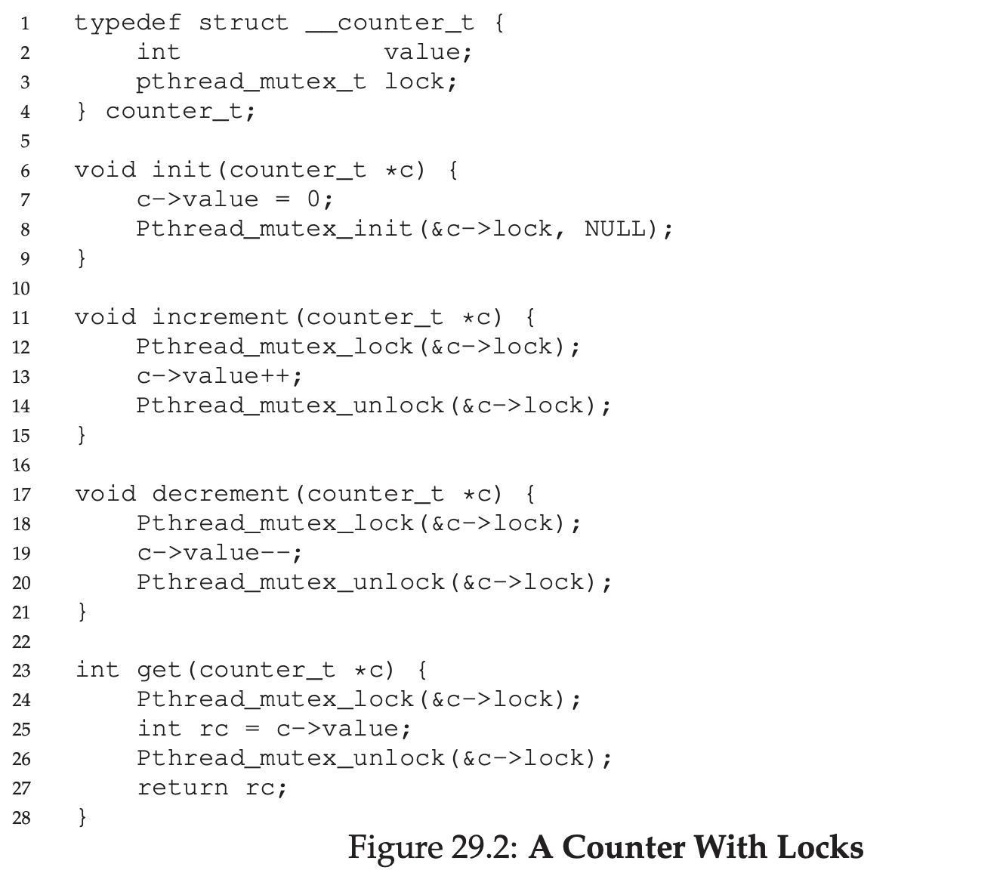
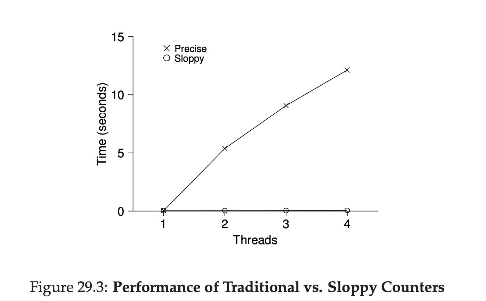
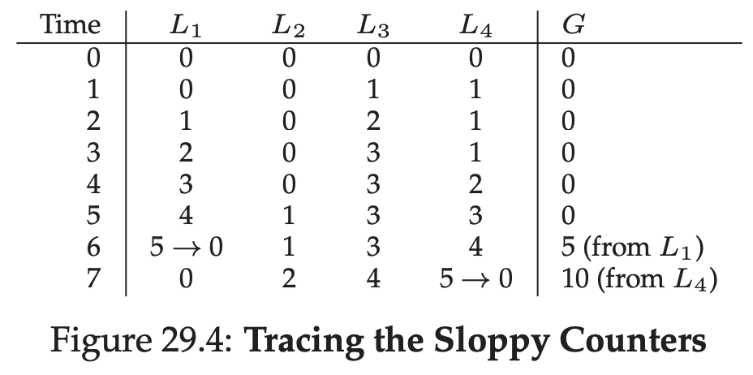
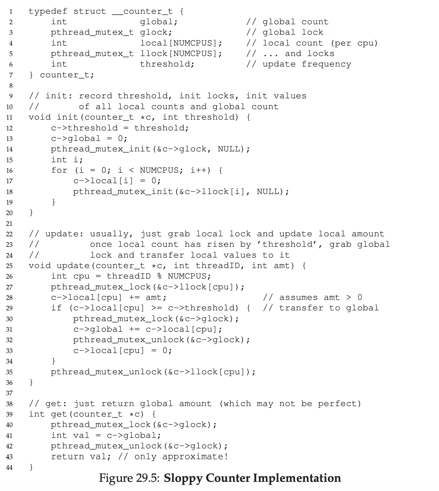
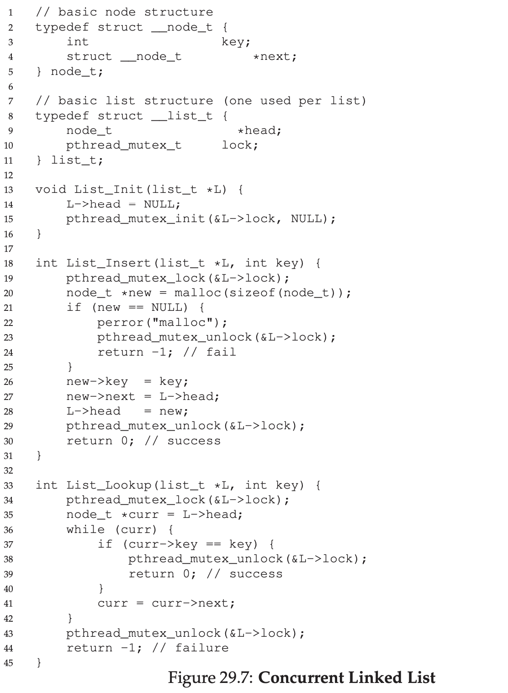
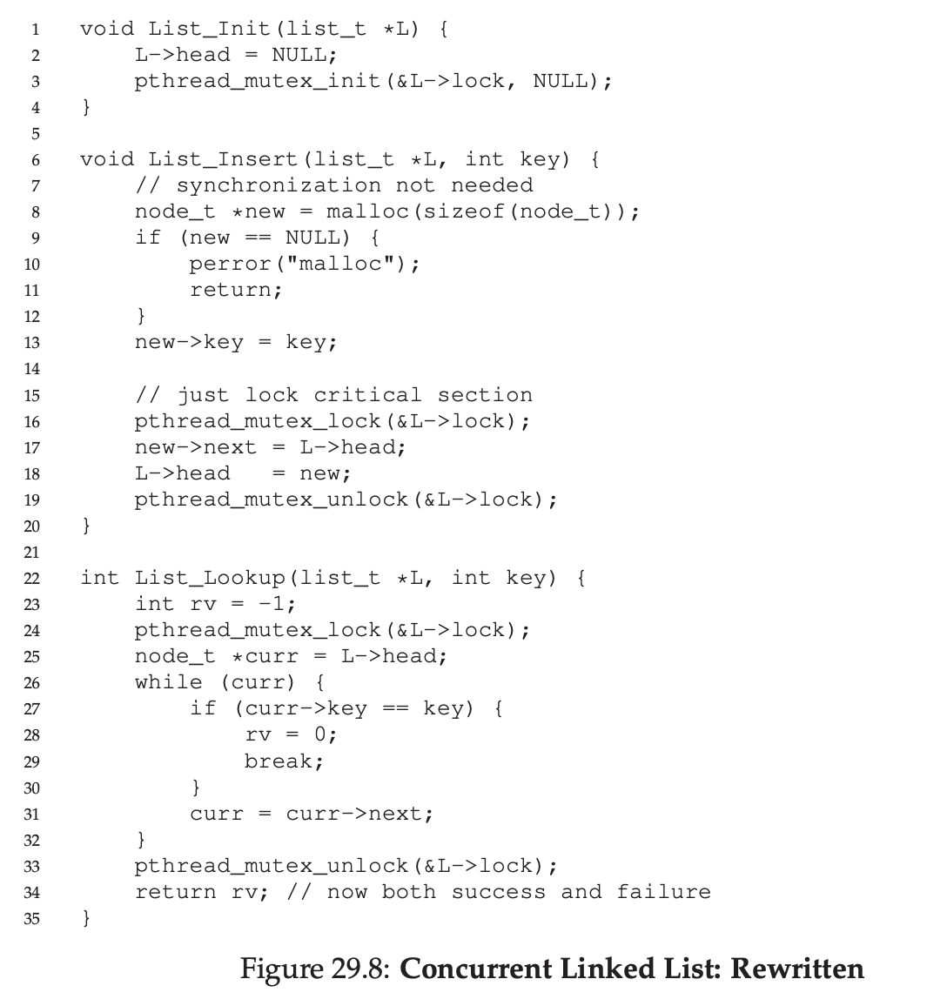

# Lock-based Concurrent Data Structures

## Concurrent Counters

One of the simplest data structure, counter.

### Simple But Not Scalable

This concurrent counter is working as intended, just add simple lock.

The problem with this is performance.

To understand why this is so slow, let's look at the benchmark with each thread trying to update the single shared counter in fixed number of times.

As you can see, the one that using lock really slow as the thread increase.

### Scalable Counting

There's an idea to solve this, it's called sloppy counter.

Basically each thread increment it's own local counter. After some time, the global counter got updated with locking.

## Concurrent Linked Lists

As you can see in the code, every time doing insert and lookup, it will do locking.

### Scaling Linked Lists

As you can see, we actually can improve the code. We don't need to lock when malloc happen, because malloc is already thread safe.
