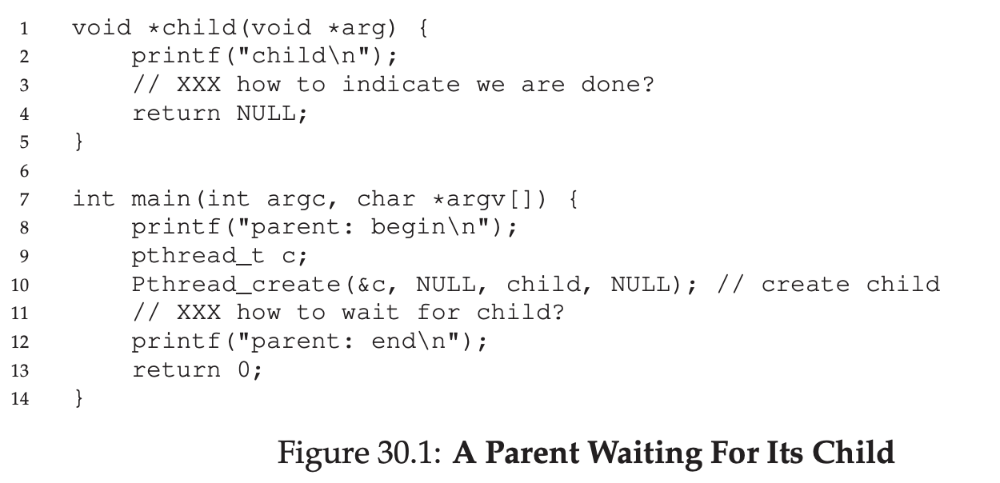
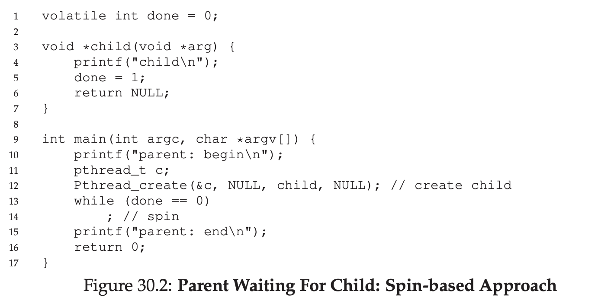
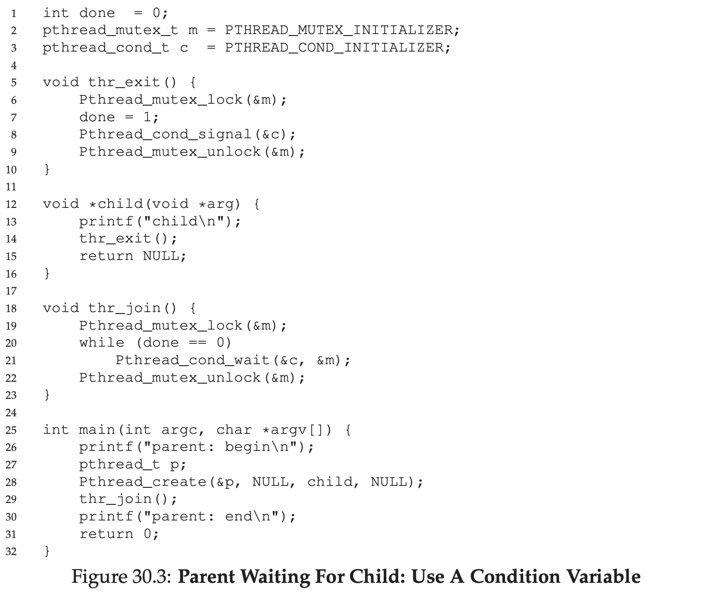
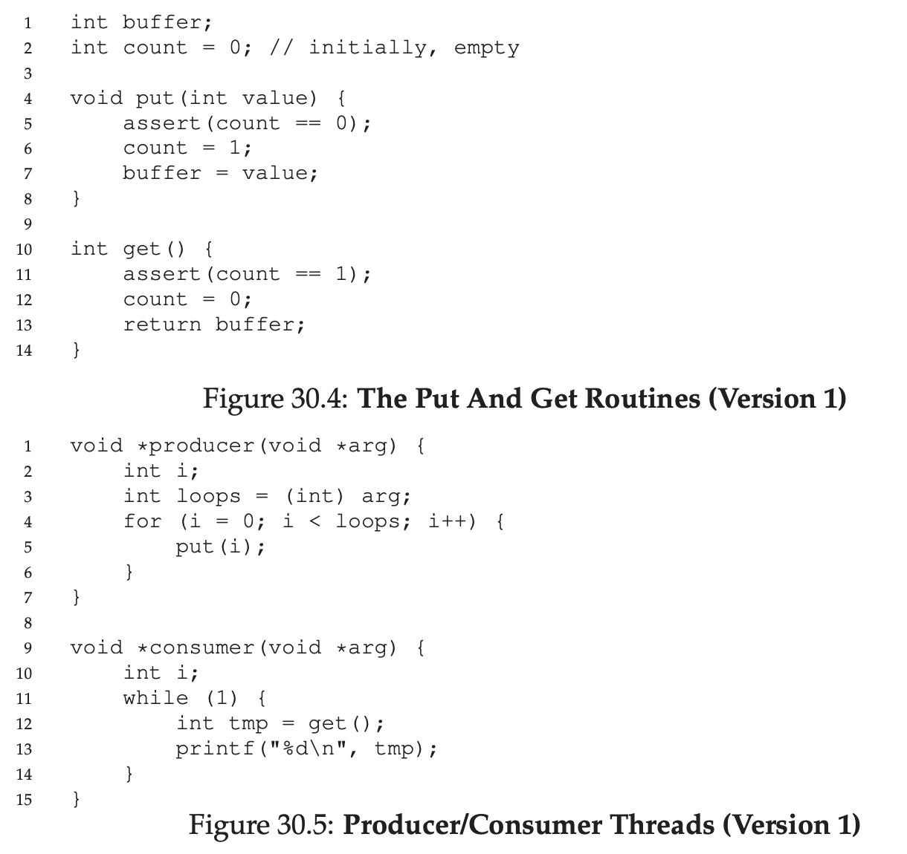
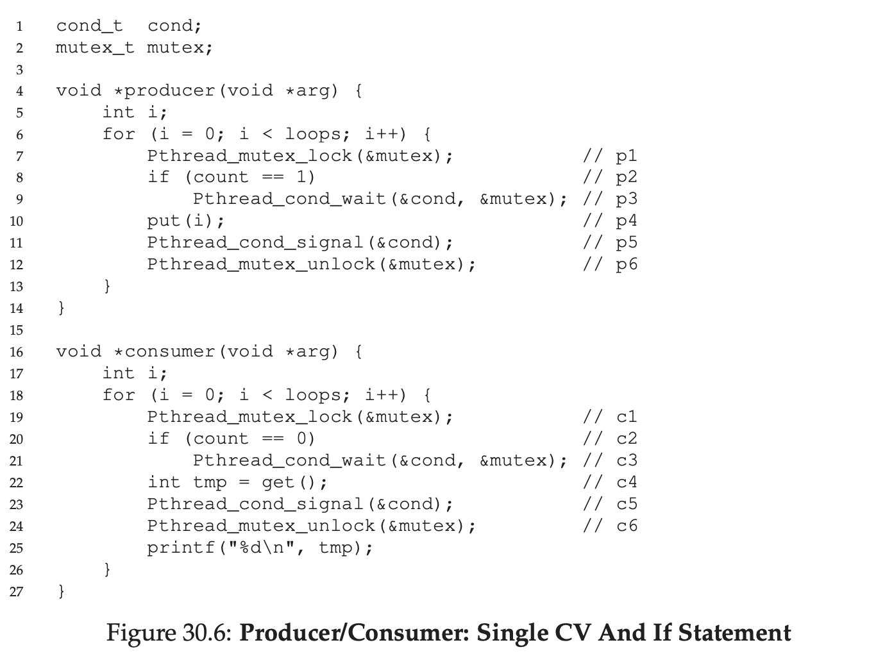
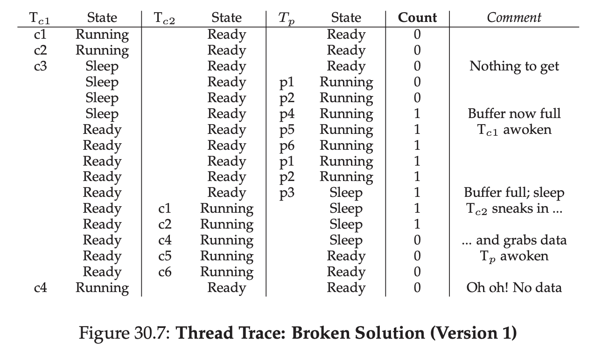
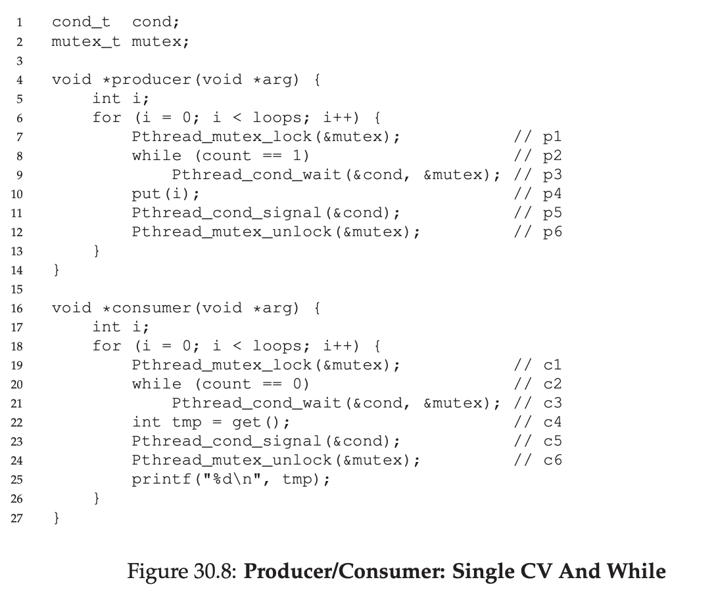
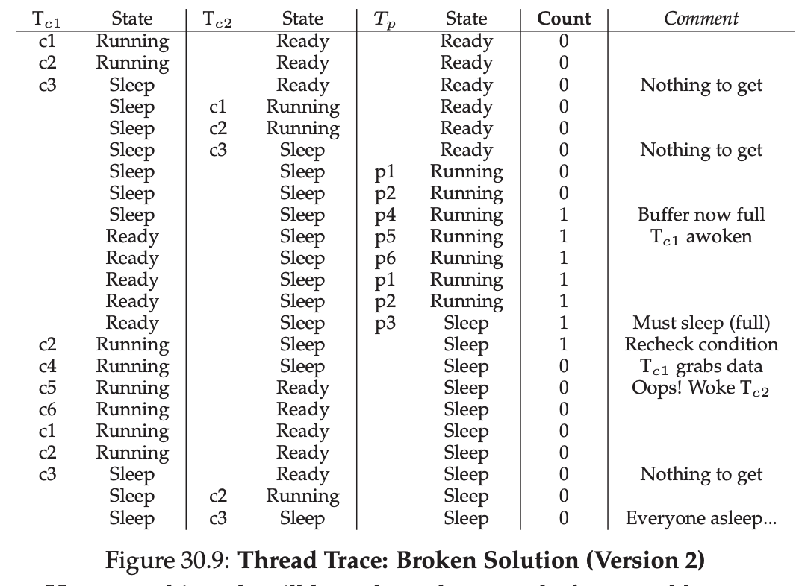
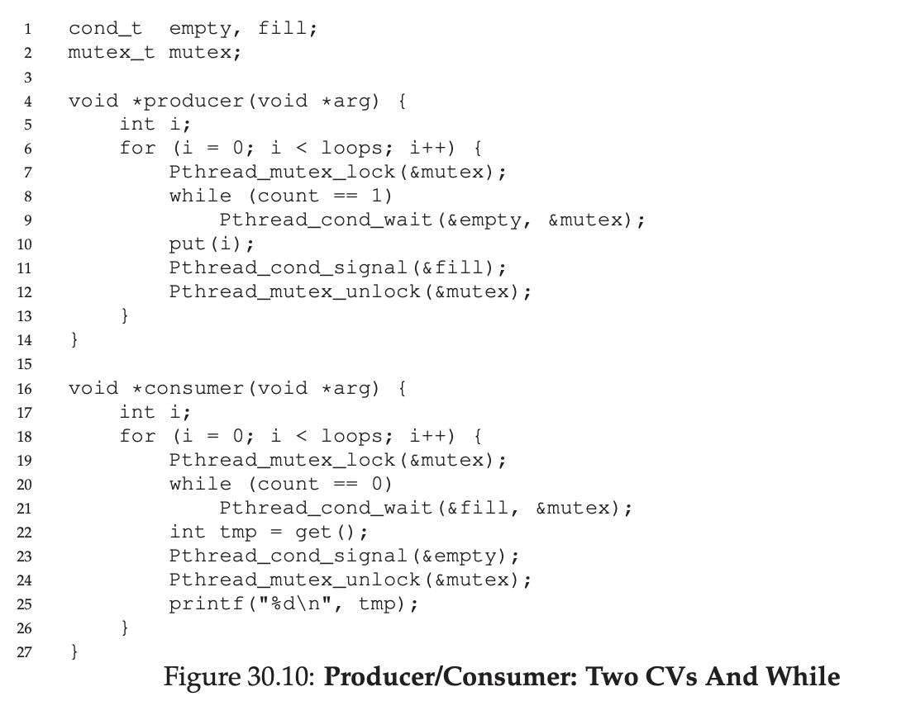

# Condition Variables

Lock is not the only thing that are needed to build concurrent program.

There are many cases where thread need to check, such as `thread_join()`

We can do it using spin based approach, but it's still wasting the CPU cycle.

## Definition and Routines

Thread can use such as condition variable.

It's basically waiting a state, if the condition is satisfied, it will notify the waiting thread and wake them up.

A condition variable has 2 operation, `wait()` and `signal()`

`wait()` is called by waiting thread.

`signal()` is called by the changer of the state.

## The Producer/Consumer (Bounded Buffer) Problem

Imagine 1 or more producer thread and 1 or more consumer thread.

Producer insert data, consumer popping data.

With this current code, there's still a chance for race condition.

Let's improve it with condition variable.

But this can cause a problem when having a multiple consumer.

We can improve this by using while

But now we have a chance to make all thread sleep because we wake up the wrong thread

We can fix it by using multiple CV

