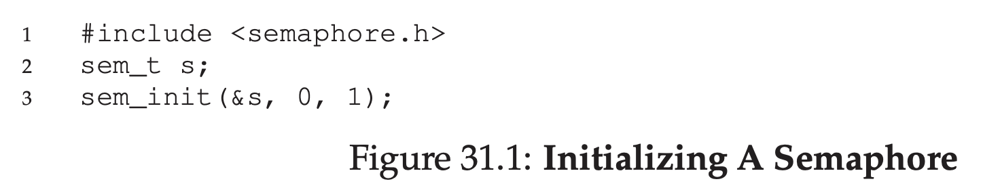
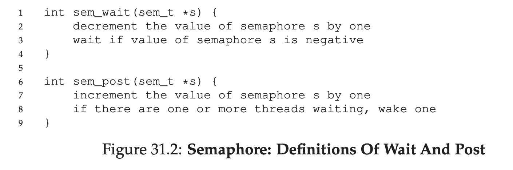
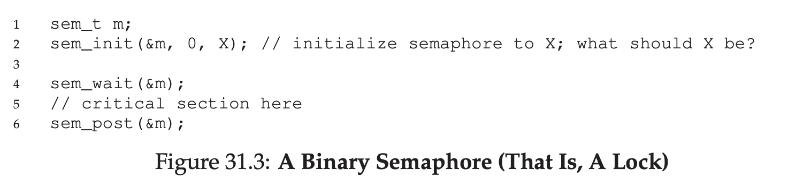
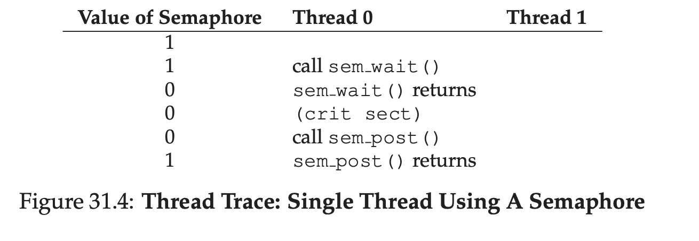
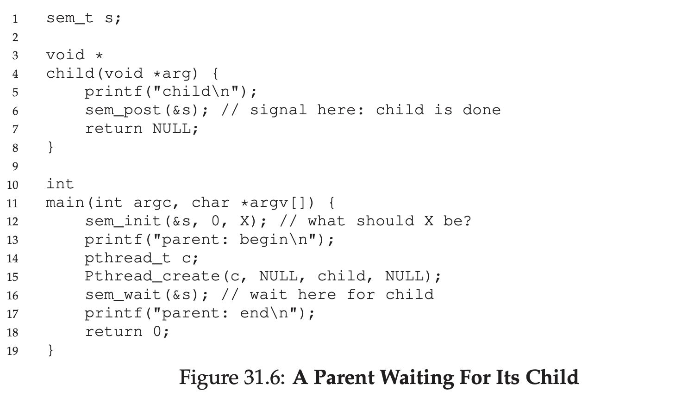
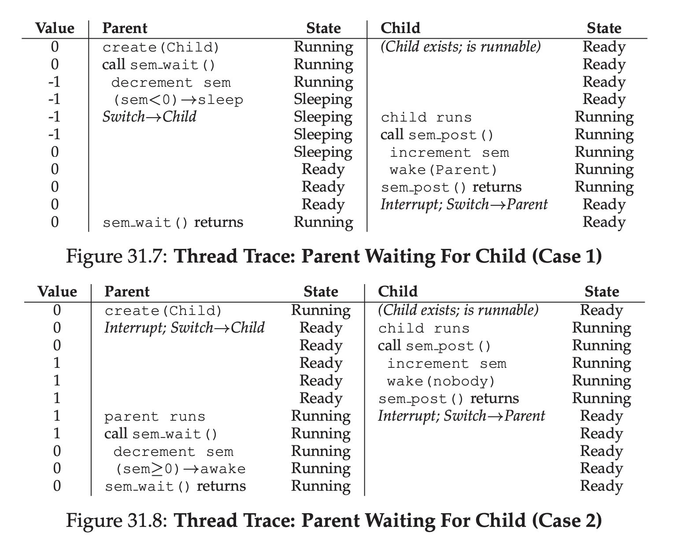
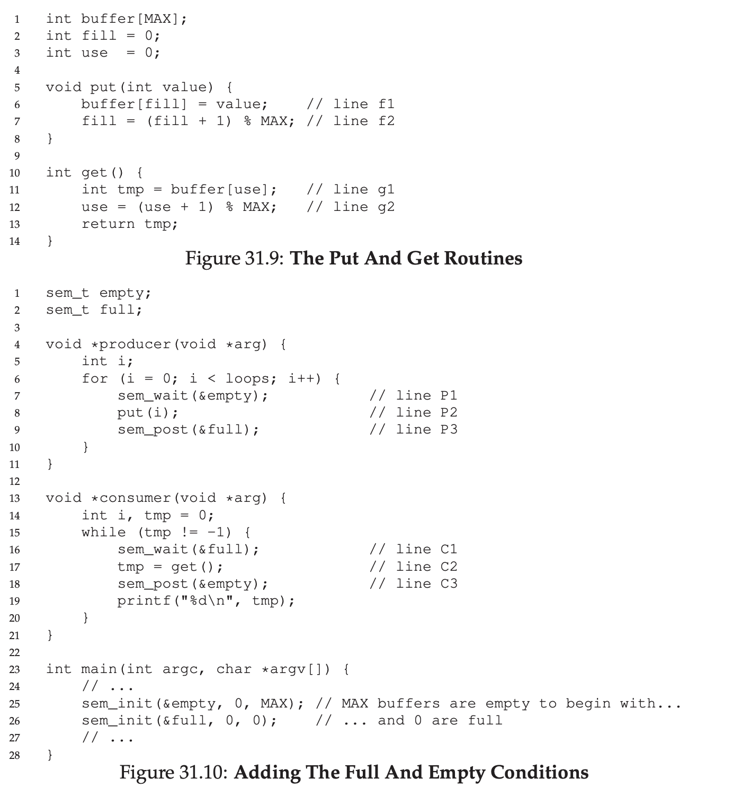
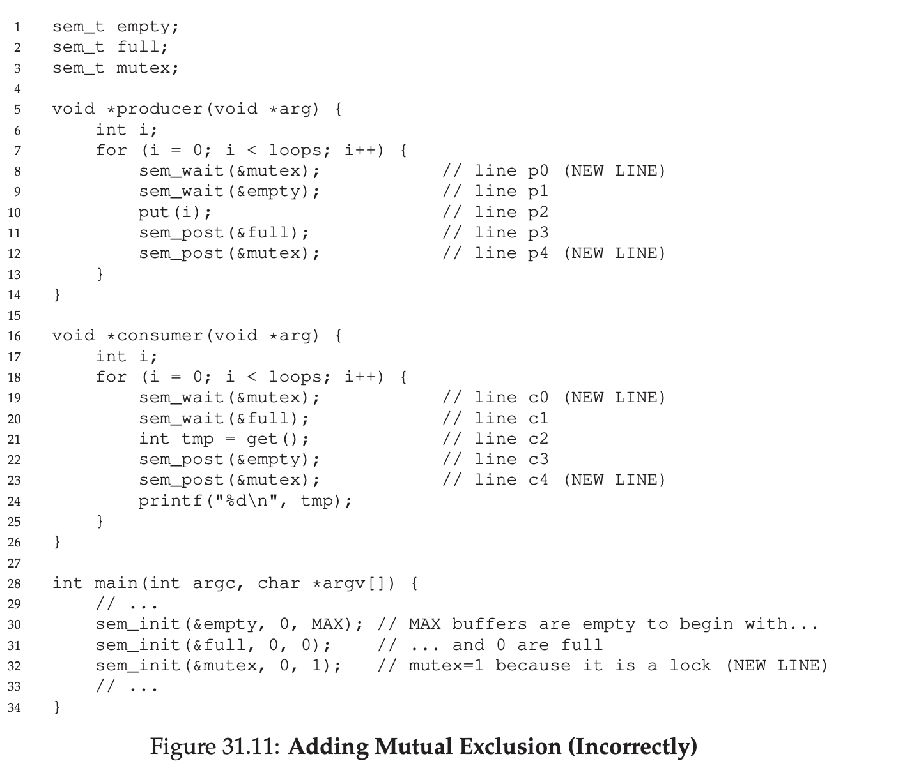
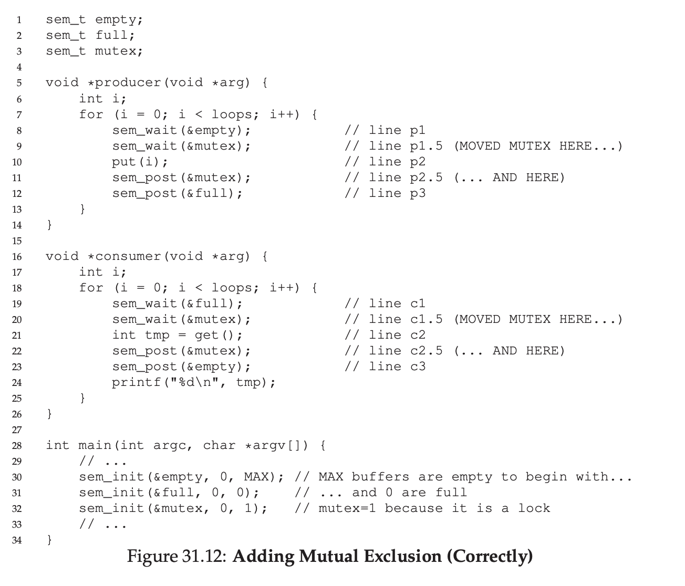
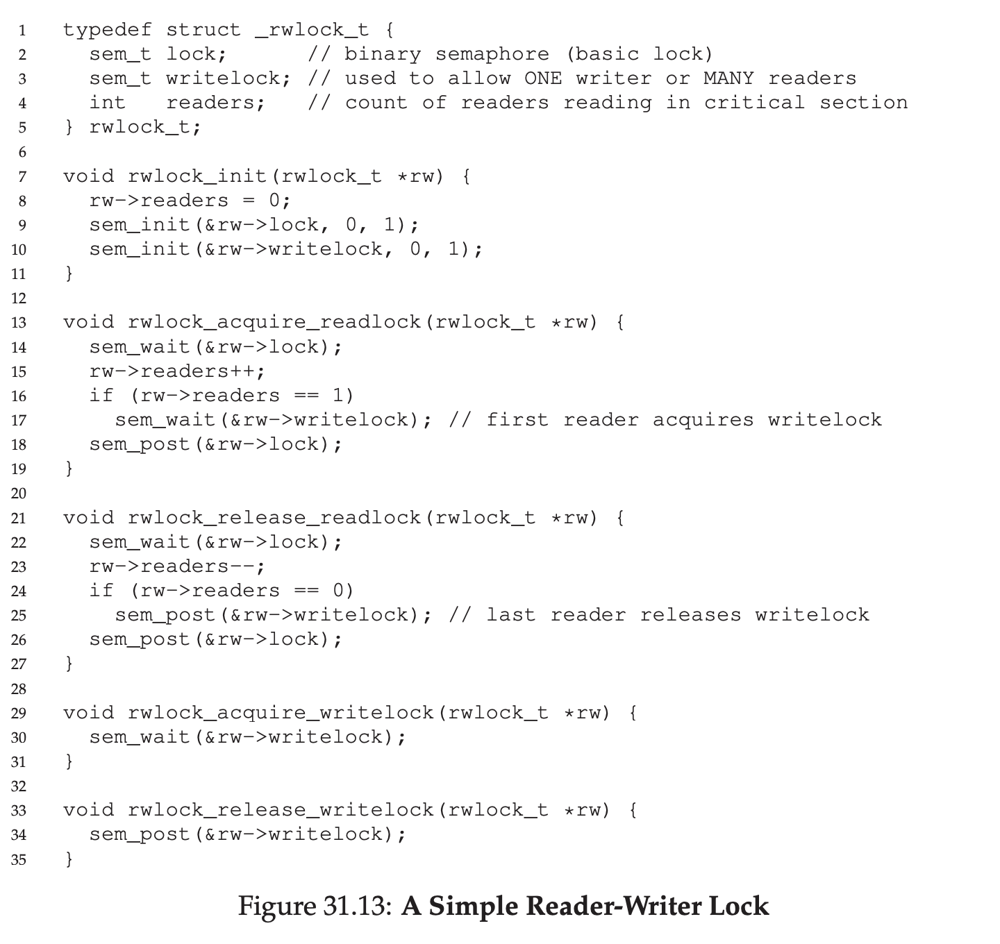

# Semaphores

## Semaphores: A Definition

Semaphore is an object with integer that we can manipulate through `sem_wait()` and `sem_post()`

Basically when `sem_wait()` is called, it will check the value. If the value is 1 or more. It will go through, else it will wait until the value is up.

`sem_post()` no need for waiting, it's increasing the value by one, and if there's a waiting thread, it will wake it up.

## Binary Semaphores (Locks)

Binary Semaphore is a semaphore that only having 1 or 0 as a value.

Basically acts like a locks

##  Semaphores As Condition Variables

Semaphore also useful when a thread want to halts it's progress waiting for a condition to become true.

For example, thread want to wait until list become non empty.

## The Producer/Consumer (Bounded Buffer) Problem

### First Attempt

First attempt is introducing 2 semaphore, which is Full & Empty.

Producer waiting on empty semaphore.

Consumer waiting on Full semaphore.

Problem will raise when max queue size is 10 and having multiple consumer and producer, there will be a race condition.

### A Solution: Adding Mutual Exclusion

We can put mutex on `put()` and `get()`

But there will be another issue, deadlock.

### Avoiding Deadlock

To avoid deadlock, we need to move our mutex

## Reader-Writer Locks

As long we can guaratee no insert is coming, no need to lock on read.

But this approach can starve the writer because there's a possibility reader can swarm the semaphore.