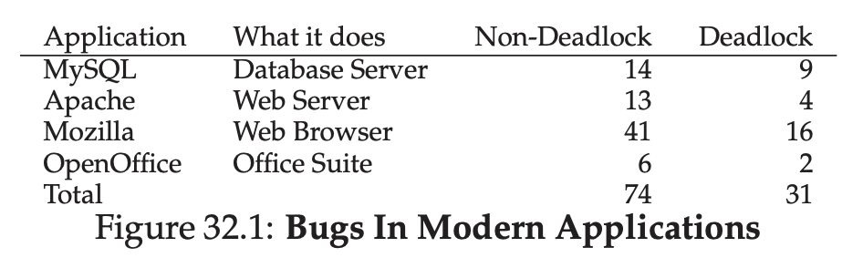
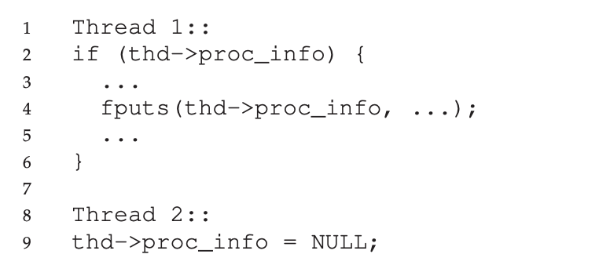
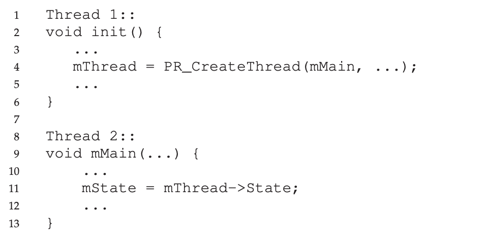
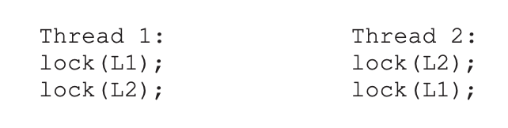

# Common Concurrency Problems

##  What Types Of Bugs Exist?

A lot of concurrency bugs usually have 2 types, deadlock and non deadlock bug.



## Non-Deadlock Bugs

### Atomicity Violation Bugs



In this code we can see there's a chance of race condition.

Formal definition of Atomicity Violation Bugs is 
```
The desired serializability among multiple memory accesses is violated (i.e. a code region is intended to be atomic, but the atomicity is not enforced during execution).
```

We can fix it by adding mutex.

### Order-Violation Bugs

Formal definition is 

```
The desired order between two (groups of) memory accesses is flipped (i.e., A should always be executed before B, but the order is not enforced during execution)”
```



To fix this, we can add condition variable.

## Deadlock Bugs

Deadlock occur, when Thread 1 is holding Lock 1, and waiting for Lock 2, but at the same time, Thread 2 is holding Lock 2, and holding Lock 1.



### Why Do Deadlocks Occur?

One reason is large codebases, developer can miss to write a proper locking.

Second reason is nature encapsulation, because the abstraction is hidden, dev can miss this also.

### Prevention

#### Circular Wait

We need to do total ordering, for example, if we want to acquire L1 and L2, we need to order it L1 -> L2 in every acquiring lock.

#### Hold-and-wait

We can avoid it by acquiring all lock at once.

#### No Preemption

We can do try-lock instead.

#### Mutual Exclusion

Or maybe we can avoid using mutex, it's hard, 

### Deadlock Avoidance Via Scheduling

Instead of avoiding deadlock, we can use scheduler to avoid overlapping thread that using same lock.

### Detect and Recover

We can do detection and recover when deadlock happens