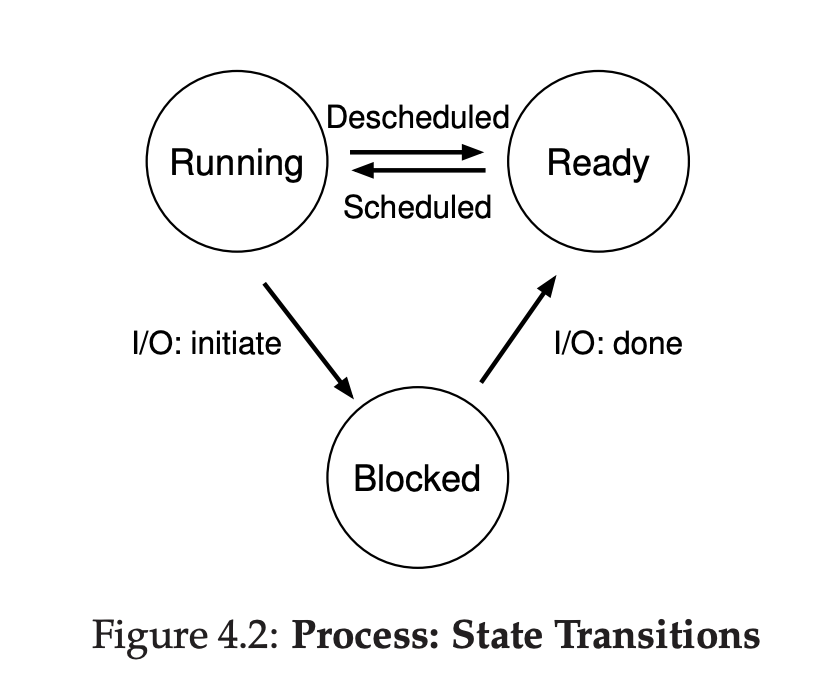

# Chapter 4 (The Abstraction: The Process)

## Process
### What is process
A running program

### Where program reside
In the disk

### What's inside a program
A bunch of instruction

### You can run more than 1 program at once
For example: you open web browser, music player, video player, etc

## Virtualizing the CPU
### Illusion
The OS creates an illusion by **Virtualizing** CPU, CPU will run a process, then pause doing that, then move to another process, run a process, pause, and so on. This technique is called **Time sharing**.

### Drawback
Because of the CPU moving back and forth to another process, this will affect the performance of the process that are running, especially when there's so many process need to be run at the same time.

### How it works
To do the Time sharing, OS need 2 things
- Mechanism (Context Switching)
- High Level Intelligence (Policies)

### Context Switching
Context Switching is a mechanism that OS do, to move CPU from doing process A, pause, move to process B, then do the process B

### Policies
Policies are algorithms for decide:
- Which process to move next
- When to move to another process

## Abstraction of Process
Process is a running program, process can read and update **something** when running.

### Memory
One of them is memory, process can read and update a memory. Instruction resides in memory, the data of a running program is also in the memory. That means, the memory that related to the program (we call it **address space**) is also a part of a program.

### Program Counter
Because a program is a bunch of instruction, we need something that keep tracks which instruction we're currently at. At hardware level, there's a special register that keeping track of that. We call it **Program Counter**, or sometimes we called it **Instruction Pointer**.

### Stack Pointer & Frame Pointer
We also have **Stack Pointer** & **Frame Pointer** that are used to manage function parameter, local variables, and return addresses.

### Devices
And also process can read I/O Devices such as Disk, etc.

## Process API

### Create
OS provides an API to create a process, ex: (If I double-click Steam icon, it will open Steam apps, if I type `code`, in terminal, it will open Visual Studio Code).

### Destroy
OS provides an API to destroy process, ex: (If I click `X` button, it will close my process).

### Wait
Instead of clicking `X` button, OS provides a `wait` operation, which means we will wait until process is finished

### Miscellaneous Control
OS can do some various action also, for example: OS can freeze the process, making the process doesn't run

### Status
OS also provides a status API, that means we can see the status of the process. Example: Task Manager

## Process Creation

### Load
OS will load program's code and static data from disk into memory, address space.

Program will be in form of executable format, which is something that can be understand by OS.

### Runtime Stack
After the program's code and static data loaded into memory, some memory must be allocated into **Stack**. C program use stack to put local variable, function parameter, and return addresses.

OS also put parameter into the main args if needed.

### Heap
OS also allocate some memory into heap. Heap is for dynamic allocated data, such as a `malloc` function, and will release the allocated memory using `free` function. Heap used for some kind of data structure like Tree, Linkedlist, Hash Tables, etc.

### Setup I/O
OS also setuping I/O devices, by default it will automatically open 3 I/O file descriptor, stdin, stdout, stderr.

### Run main() function
After all of that complete, it will start to run main() function. OS now transfer the control of the process to the CPU.

## Process States
### Running
Process is currently running at the moment

### Ready
Process is ready to be run, but currently not running because of some reason, example: CPU is running another process at the moment.

### Blocked
Process can't run because of some reason, example: Process reading something at the disk, and still waiting Disk I/O to be done.

From Ready -> Running = Process has been scheduled

From Running -> Ready = Process has been descheduled

From Running -> Blocked = Process did I/O and waiting for the devices to finish

From Blocked -> Ready = Device I/O done, ready to be scheduled

## Data Structure
OS also a program, a program that keep track the running process. That means OS will have some kind of data structure that stores the process that currently Running, Ready, Blocked.

## Summary
Process is a running program, when we start a program at the first time, OS will move some important stuff from disk into memory, after some of the stuff already done, OS will delegate the running into CPU. OS will keep track which process that's currently running, ready to run, and blocked.