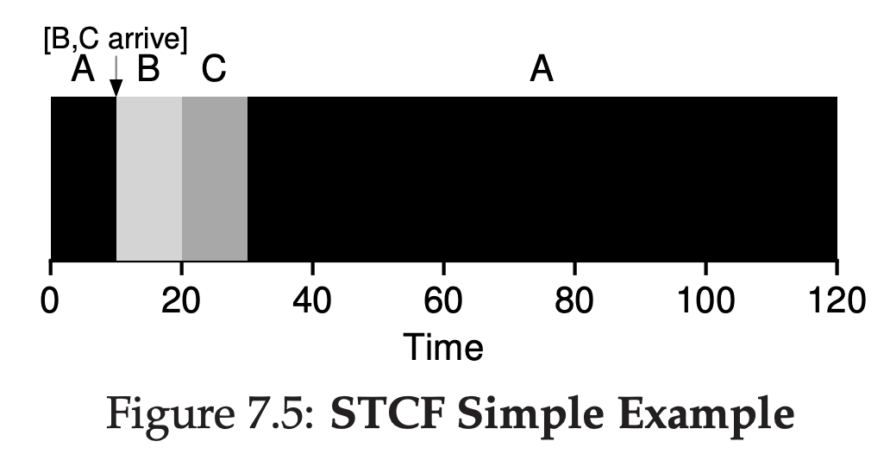
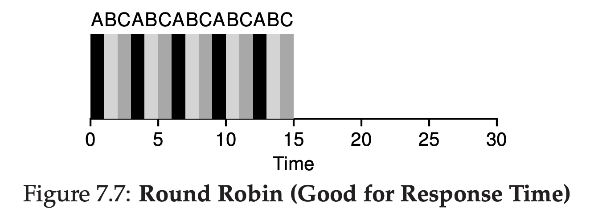
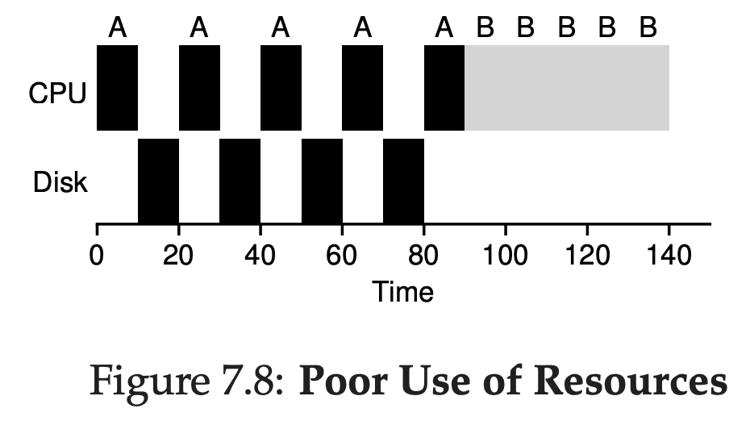
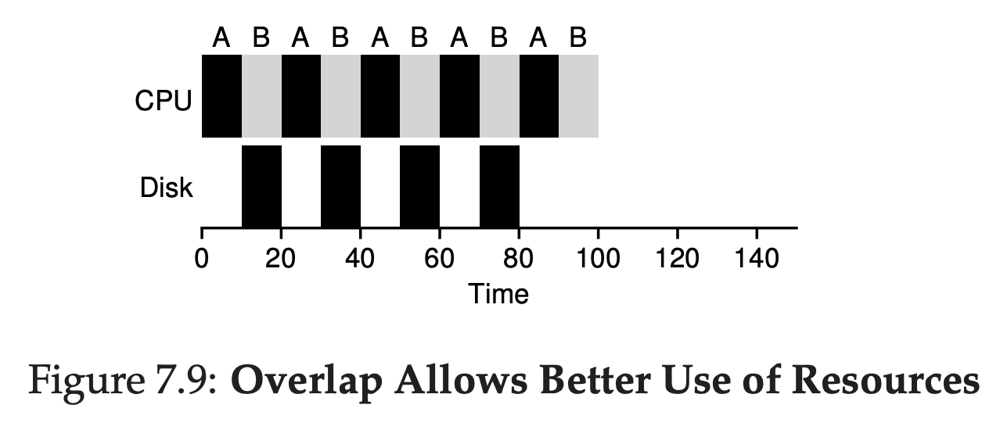

# Scheduling: Introduction

## Workload Assumption
- Each job runs for the same amount of time.
- All jobs arrive at the same time.
- Once started, each job runs to completion.
- All jobs only use the CPU (i.e., they perform no I/O)
- The run-time of each job is known.

This is actually not realistic

## Scheduling Metrics

For now, we just use single metrics.

### Turnaround Time

<i>Tturnaround = Tcompletion - Tarrival</i>

## First In First Out (FIFO) / First Come First Served (FCFS)

### Why
Because it's simple

### Example

Imagine there's task A, B, C. Because we have assumption all jobs ariive at the same time, all of it has turnaround of 0. Assuming each job runs for 10 sec. What's the average turnaround?

A got scheduled first at T = 0, it took 10 sec, that means it will finished at T = 10.

B got scheduled after that at T = 10, it took 10 sec, it will finished at T = 20.

C got scheduled at T = 20, took 10 sec, finished at T = 30.

A turnaround = 10 - 0
B turnaround = 20 - 0
C turnaround = 30 - 0

**Result is: (10 + 20 + 30) / 3 = 20**

### When FIFO is not doing good

From this images, you can see the result is really bad

**Result is: (100 + 120 + 130) / 3 = 110**

It's called **convoy effect**, where short potential task get queued by longer and heavier task.

## Shortest Job First (SJF)

Simple, you have a Priority Queue, you take the shortest one.

**Result is: (10 + 20 + 120) / 3 = 50**

Given assumption all jobs will come at the same time, **SJF is the most optimal** scheduling algorithm.

### What if the task is not always comes at T = 0?

**The result will be: (100 + (110 - 10) + (120 - 10)) / 3 = 103.33**

## Shortest Time-to-Completion First (STCF)

We did said about
>Once started, each job runs to completion.

I think we need to revise that, because SFJ giving us a bad result when big job coming first.

Now let's have an ability to **preempt** the job A and decide to run a better job.

Now as you can see, STCF will give a better result now

**Result is: (120 + (20 - 10) + (30 - 10)) / 3 = 50**

## New Metric: Response Time

<i>Tresponse = Tfirst run - Tarrival</i>

STCF is not really good for response time. Because if there's a big job coming, and suddenly a lot of smaller job coming also, that big job will never get picked up.

## Round Robin

The concept is simple, instead of running job to completion, it will run job per time slice, and then switch to next job and do the same. It will do this until the job is finished.

Because of that, the duration of time slicing is important here.

Shorter time slice, that means scheduler can run a lot of jobs very quick. But the amount of context switching also become a lot also.

It's good for Response Time, but it's bad for Turnaround, because it's trying to do all of the queuing jobs.

## Incorporating I/O

Now, let's revise this

>All jobs only use the CPU (i.e., they perform no I/O)

We all know a lot of jobs is having I/O. Like sending a network packet, reading files, inserting to databases, etc. So let's remove this assumption.

When job initiate an I/O request, the job will get blocked waiting for I/O completion. Because of that, scheduler should move to another job while waiting the current job finished it's I/O request.

## No more oracle

Let's revise this also

> The run-time of each job is known.

We all know OS doesn't know the job length will be. So let's remove this also.

From my perspective, I think Round Robin algorithm is better here.

## Summary

There's a lot of Scheduling Algorithm out there, for each of them, having a pros and cons of it's own.

We need to know that moving jobs to another jobs will be having Context Switching.

Moving jobs too quickly will have a Context Switching overhead.

But moving jobs too slowly will affect another jobs will not getting picked up by CPU.

We also need to know that jobs will not be running on CPU when doing I/O, to make it efficient, we need to move to another job first while waiting that jobs finished doing I/O request.