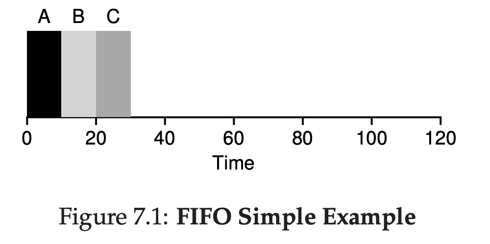
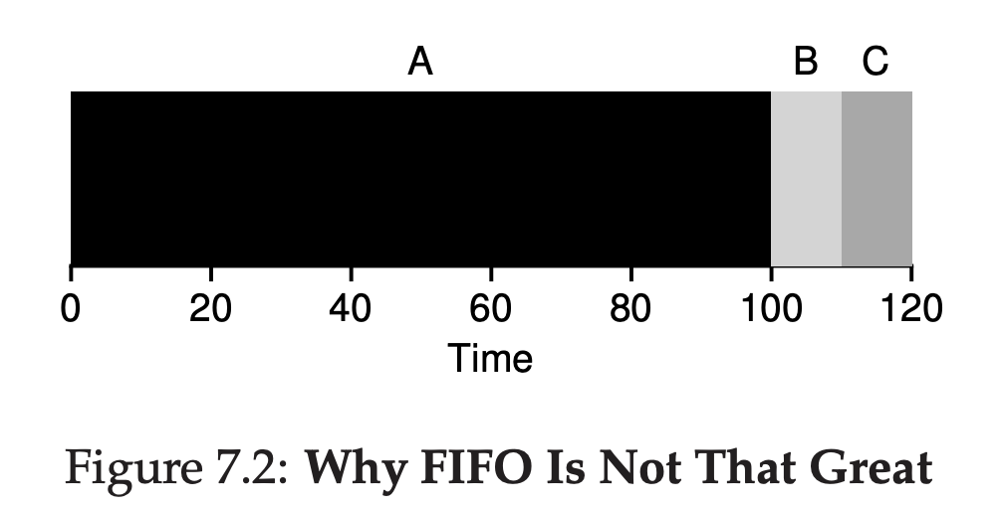
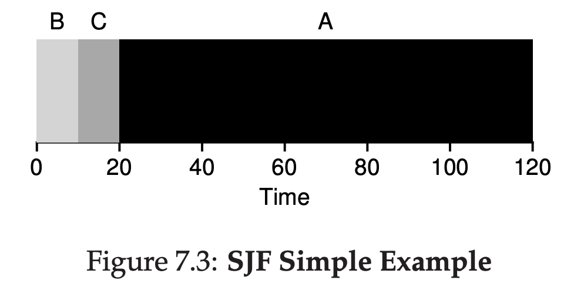
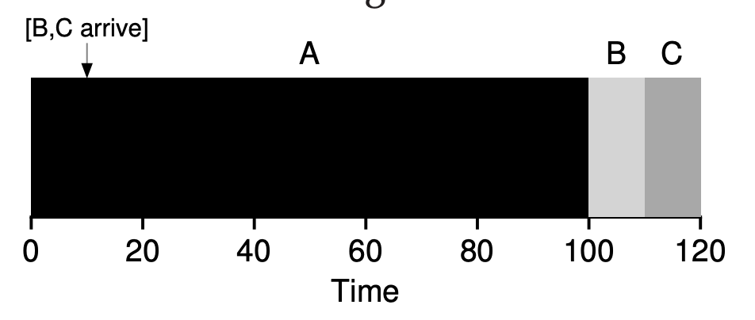

# Scheduling: Introduction

## Workload Assumption
- Each job runs for the same amount of time.
- All jobs arrive at the same time.
- Once started, each job runs to completion.
- All jobs only use the CPU (i.e., they perform no I/O)
- The run-time of each job is known.

This is actually not realistic

## Scheduling Metrics

For now, we just use single metrics.

### Turnaround Time

<i>Tturnaround = Tcompletion - Tarrival</i>

## First In First Out (FIFO) / First Come First Served (FCFS)

### Why
Because it's simple

### Example

Imagine there's task A, B, C. Because we have assumption all jobs ariive at the same time, all of it has turnaround of 0. Assuming each job runs for 10 sec. What's the average turnaround?

A got scheduled first at T = 0, it took 10 sec, that means it will finished at T = 10.

B got scheduled after that at T = 10, it took 10 sec, it will finished at T = 20.

C got scheduled at T = 20, took 10 sec, finished at T = 30.

A turnaround = 10 - 0
B turnaround = 20 - 0
C turnaround = 30 - 0

**Result is: (10 + 20 + 30) / 3 = 20**

### When FIFO is not doing good

From this images, you can see the result is really bad

**Result is: (100 + 120 + 130) / 3 = 110**

It's called **convoy effect**, where short potential task get queued by longer and heavier task.

## Shortest Job First (SJF)

Simple, you have a Priority Queue, you take the shortest one.

**Result is: (10 + 20 + 120) / 3 = 50**

Given assumption all jobs will come at the same time, **SJF is the most optimal** scheduling algorithm.

### What if the task is not always comes at T = 0?

**The result will be: (100 + (110 - 10) + (120 - 10)) / 3 = 103.33**

## Shortest Time-to-Completion First (STCF)

