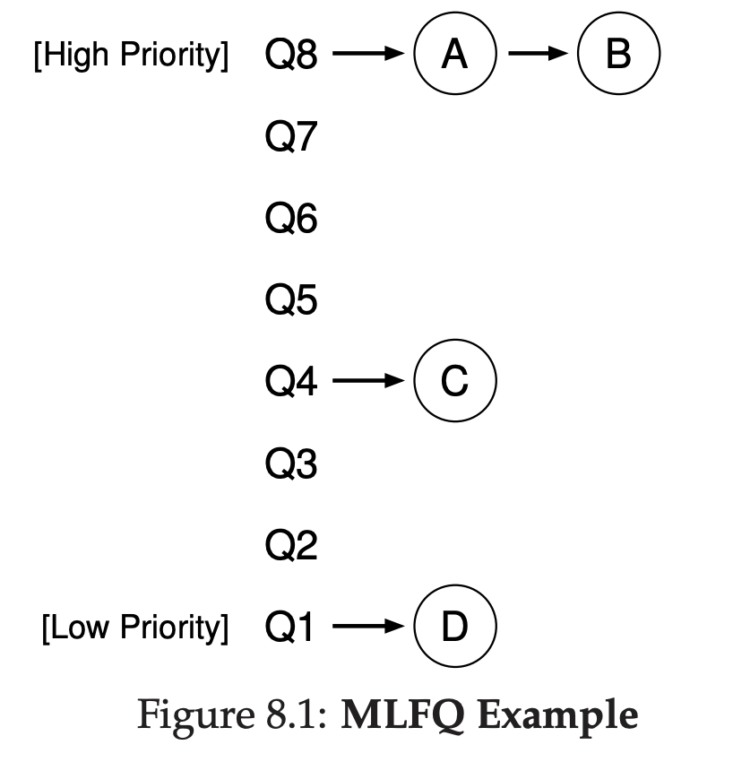
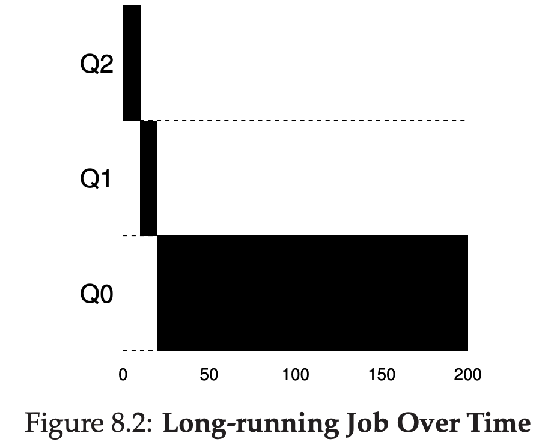
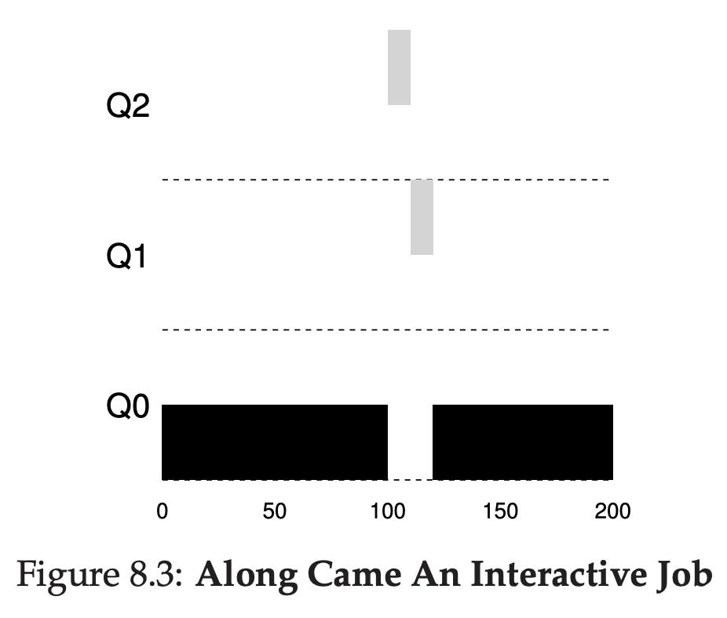
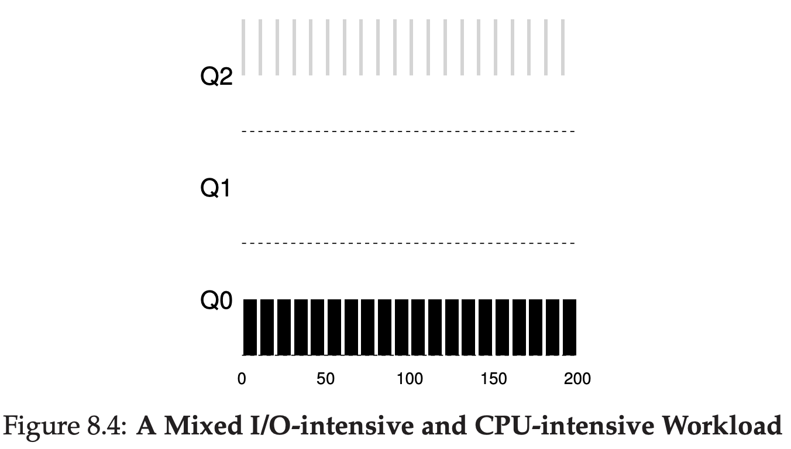

# Scheduling: The Multi-Level Feedback Queue

## Why

Optimize turnaround time

Minimize response time.

Round robin only improve response time, but worst at turnaround time.

## MLFQ Basic Rules

Has a number of queues, each assigned priority level.

- Rule 1: If Priority(A) > Priority(B), A runs (B doesn’t).
- Rule 2: If Priority(A) = Priority(B), A & B run in RR.

## Attempt #1: How To Change Priority

- Rule 3: When a job enters the system, it is placed at the highest
priority (the topmost queue).
- Rule 4a: If a job uses up an entire time slice while running, its priority is reduced (i.e., it moves down one queue).
- Rule 4b: If a job gives up the CPU before the time slice is up, it stays
at the same priority level.

### Example 1: A Single Long-Running Job

Job is coming, and eventually the job goes to bottom priorities because it's always taking a lot of time.

### Example 2: Along Came A Short Job

While the long running process still on the lowest priority, new process comes, and goes to top priority, it goes down because it's taking more time, but before it goes down again, the process is done.

### Example 3: What About I/O?

If the process preempt before the timeslice ends, then the process will not get penalized. While waiting for I/O to end, it will go to another process that is in same priority or below it.

## Problem with MLFQ

First, if there's too many small process going into the queue, the lower priority process will not get a chance to get executed by CPU, this is called **starvation**.

Second, a programmer for the application can trick the scheduler by doing random I/O, if this done correctly, the process can preempt to prevent it to go to lower priority.

Third, process behavior can change, what if at the start of the process, it will do heavy CPU, and then in the end it will do heavy I/O? The process already go to lower priority because the process done heavy CPU.

## Attempt #2: Priority Boost

- Rule 5: After some time period S, move all the jobs in the system
to the topmost queue.

## Attempt #3: Better Accounting

To prevent programmer of application tricking the scheduler by using random I/O, we need to change our rule.

- Rule 4: Once a job uses up its time allotment at a given level (regardless of how many times it has given up the CPU), its priority is reduced (i.e., it moves down one queue)

## Summary

To improve the existing Round Robin algorithm, there's another scheduler named Multi Level Feedback queue. It has some queue to help categorize which process should be prioritize. If the process took too long to execute, it will go down 1 level. Lower level means the higher process will be executed first than that level.