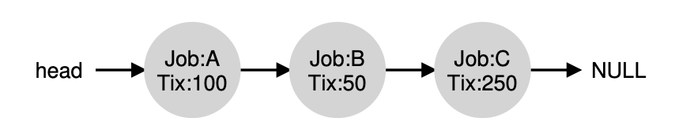

# Scheduling: Proportional Share (Fair Share)

## Why

Instead of optimizing turnaround or response time. Scheduler will try to guarantee each job obtain percentage of CPU time.

## Basic Concept: Tickets Represent Your Share

Each process will have **tickets**, tickets is just a representative of share it owns to a CPU.

### Example

Imagine there's only 2 process:

**Process A**: 75 tickets

**Process B**: 25 tickets

That means process A is having 75% share of total CPU, and B only have 25%.

Holding ticket is straightforward, scheduler just need to keep track how many ticket for each process have.

Then scheduler just need to pick a random number from 1-100.

If number 1-75 picked. Process A got executed by CPU.

If number 76-100 picked. Process B got executed by CPU.

## Implementation

You need random number generator to pick the winning ticket, and a data structure to keep track of the process, and total number of ticket.

Example:

- Random number got generated is 300
- The pointer start from head, go to Job A
- Because total ticket is 100, 100 is lesss than 300, pointer go to next
- Pointer go to B, total now 150
- Because total ticket is 150, 150 is lesss than 300, pointer go to next
- Pointer go to C, total now 400, 400 >= 300, C go picked.

## How to assign ticket

User of the computer will assign the ticket to the process.

## Why not deterministic

Because randomness sometimes doesn't deliver the exact proportion, Waldspurger invented new algorithm called **Stride scheduling**. 

## Summary

There's another type of scheduling called Proportional Share scheduling, it's implemented by using lottery ticket, scheduler will try to generate random number to determine which process that gonna picked up. The ticket is assigned by the user. If user doesn't want to use randomness check, user can use Stride scheduling.